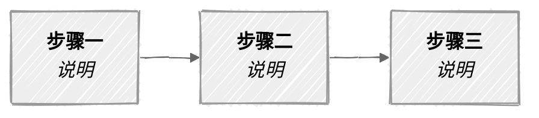

# generate-diagram

> 用途：为 vault 文档生成可视化图表（架构图、关系图、流程图、信息图），嵌入到 Markdown 文件中。
> 适用：所有 agent。需要在 .md 文件中插入图表时触发本 skill。
> 前置规范：[[Markdown文档输出规范]] §9、[[SVG架构图设计规范]]、[[流程图绘制规范]]

---

## 1 选型决策树

```text
需要画图？
 |
 +-- 是文件目录树？
 |    -> ASCII tree（唯一例外，见 MD输出规范 §9.1.1）
 |
 +-- 节点 <= 6 且无泳道？
 |    -> Mermaid handDrawn（内联，零文件）
 |
 +-- 节点 > 6 或需要泳道/多角色？
 |    -> drawio XML（插件渲染，可交互编辑）
 |
 +-- 全局架构图/方法论总图/需要精确视觉控制？
 |    -> Agent 手写 SVG（像素级布局，品牌色/字体对齐）
 |
 +-- 非正式草图/头脑风暴？
 |    -> Excalidraw（自由画布）
 |
 +-- 需要 Graphviz/PlantUML 等特殊语法？
 |    -> 在线 API 渲染（kroki.io）-> 保存 SVG 嵌入
 |
 +-- 不确定？
      -> 默认 Mermaid，复杂再升级 drawio/SVG
```

---

## 2 四种生成路径

### 路径 A：Mermaid 内联

**零文件生成**，直接写在 `.md` 代码块中，Obsidian 原生渲染。

强制规则（详见 [[Markdown文档输出规范]] §9.3）：

- 首行 `%%{init: {'look': 'handDrawn', 'theme': 'neutral'}}%%`
- 单图 <= 6 个主节点
- 业务流程 `LR`，层级架构 `TB`，堆叠模型 `BT`
- 节点文字用 `<b>` + `<br/>` + `<i>` 分层
- subgraph <= 2 层嵌套

模板：

````markdown

````

### 路径 B：drawio XML

生成 `.drawio` 文件，由 Obsidian drawio 插件（v1.5.4）渲染。

强制规则（详见 [[流程图绘制规范]]）：

- 泳道流程（角色 >= 2）首选
- 文件放在对应模块目录下
- 嵌入前加标题说明行

操作步骤：

1. 用 Write 工具写出 drawio XML 到目标路径
2. 在 .md 文件中用 `![[文件名.drawio]]` 嵌入
3. 前面加一行说明文字

嵌入模板：

```markdown
**XX主业务流程**：

![[流程01-主业务流.drawio]]
```

### 路径 C：Agent 手写 SVG

Agent 直接输出 SVG XML 代码，保存为 `.svg` 文件。Obsidian 原生支持 SVG 渲染。

适用场景：

- 全局架构图（多层、多区域、需精确布局）
- 方法论总图（品牌色 token、统一字体、KPI 卡片）
- 需要 pixel-level 控制的信息图

强制规则（详见 [[SVG架构图设计规范]]）：

- viewBox 响应式（不硬编码 width/height），推荐 `0 0 1280 1500`
- 字体：`-apple-system, 'PingFang SC', 'Microsoft YaHei', sans-serif`
- 色值对齐品牌 token：品牌主色 `#2563EB`、各角色色系见规范
- 用 `<defs>` 集中定义 CSS class + arrow marker + gradient
- 用 `<g transform="translate(x,y)">` 定位元素组
- 中文行高 >= 字号 x 1.6

操作步骤：

1. 确定画布尺寸和层级结构
2. 在 `<defs>` 中写 CSS + marker + gradient
3. 逐层构建 `<g>` 元素组（标题区 -> 各层卡片 -> 箭头 -> 图例 -> 页脚）
4. 用 Write 工具写出 `.svg` 到目标路径
5. 在 .md 中用 `![[文件名.svg]]` 嵌入

SVG 骨架模板：

```xml
<?xml version="1.0" encoding="UTF-8"?>
<svg xmlns="http://www.w3.org/2000/svg" viewBox="0 0 1280 900">
<defs>
<style>
  .title { font: bold 28px -apple-system, 'PingFang SC', sans-serif; fill: #1a1a2e; }
  .subtitle { font: 16px -apple-system, 'PingFang SC', sans-serif; fill: #666; }
  .card-title { font: bold 14px -apple-system, 'PingFang SC', sans-serif; fill: #333; }
  .card-line { font: 12px -apple-system, 'PingFang SC', sans-serif; fill: #555; }
  .layer-tag { font: bold 11px -apple-system, 'PingFang SC', sans-serif; fill: #fff; }
</style>
<marker id="arr" viewBox="0 0 10 7" refX="10" refY="3.5"
        markerWidth="8" markerHeight="6" orient="auto-start-reverse">
  <path d="M0,0 L10,3.5 L0,7z" fill="#333"/>
</marker>
</defs>

<!-- 标题区 -->
<text x="640" y="40" text-anchor="middle" class="title">图表标题</text>
<text x="640" y="65" text-anchor="middle" class="subtitle">副标题说明</text>

<!-- 内容区 -->
<g transform="translate(40, 100)">
  <!-- 卡片/节点/箭头在此构建 -->
</g>

</svg>
```

嵌入模板：

```markdown
**息壤 V8 四层架构**：

![[息壤V8-架构图.svg]]
```

Vault 中已有 4 个成功实例：

| 文件 | 行数 | 用途 |
|------|------|------|
| `多智能体协作方法论-v5-架构图.svg` | ~400 | V5 架构 |
| `多智能体协作方法论-v6-架构图.svg` | ~450 | V6 架构 |
| `智能体协作方法论-v7-架构图.svg` | ~567 | V7 单 Agent 架构 |
| `息壤V8-架构图.svg` | ~600 | V8 四层架构 |

### 路径 D：在线 API 渲染（降级方案）

当需要 Graphviz DOT、PlantUML、D2 等本地未安装的语法时，通过在线 API 生成 SVG。

操作步骤：

1. 编写图表源码（DOT/PlantUML/D2 语法）
2. 用 curl 调用渲染 API
3. 保存返回的 SVG 到 vault
4. 用 `![[文件名.svg]]` 嵌入

curl 模板（kroki.io）：

```bash
# Graphviz DOT -> SVG
echo 'digraph { A -> B -> C }' | curl -s -X POST https://kroki.io/graphviz/svg -d @- -o "目标路径/图表名.svg"

# PlantUML -> SVG
echo '@startuml
Alice -> Bob: hello
@enduml' | curl -s -X POST https://kroki.io/plantuml/svg -d @- -o "目标路径/图表名.svg"

# D2 -> SVG
echo 'x -> y -> z' | curl -s -X POST https://kroki.io/d2/svg -d @- -o "目标路径/图表名.svg"
```

注意事项：

- 需要联网，离线不可用
- 返回的 SVG 可能需要手动调整尺寸/字体
- 优先用路径 A/B/C，此路径仅作降级

---

## 3 文件命名与存放

| 图表类型 | 文件格式 | 存放路径 | 命名规则 |
|---------|---------|---------|---------|
| Mermaid | 无（内联） | 直接在 .md 中 | 无 |
| drawio | `.drawio` | 对应模块目录 | `流程{序号}-{名称}.drawio` |
| SVG 架构图 | `.svg` | 与文档同级目录 | `{文档名}-架构图.svg` 或 `{主题}.svg` |
| SVG 信息图 | `.svg` | 与文档同级目录 | `{文档名}-{图表主题}.svg` |
| API 生成 | `.svg` | 与文档同级目录 | `{工具名}-{主题}.svg` |

---

## 4 嵌入规范

所有非 Mermaid 图表嵌入到 .md 时必须遵守：

1. **前置说明**：嵌入 `![[]]` 前加一行加粗标题说明图表内容
2. **前后空行**：嵌入行前后各 1 个空行（块元素规则）
3. **不重复描述**：图已说清的内容不再用文字复述
4. **嵌入语法**：统一用 wikilink `![[文件名.svg]]`，不用 markdown 图片语法

正确示例：

```markdown
**息壤 V8 四层架构**：

![[息壤V8-架构图.svg]]
```

错误示例：

```markdown
![[息壤V8-架构图.svg]]
上面是架构图。
```

---

## 5 质量检查清单

图表生成后逐项自查：

- [ ] **选型正确**：按决策树选择了合适的工具（Mermaid/drawio/SVG/API）
- [ ] **Mermaid 手绘风**：内联 Mermaid 首行含 `%%{init: {'look': 'handDrawn', 'theme': 'neutral'}}%%`
- [ ] **Mermaid 节点数**：内联 Mermaid 主节点 <= 6 个
- [ ] **SVG 响应式**：手写 SVG 用 viewBox 不硬编码 width/height
- [ ] **SVG 字体**：使用规范字体栈 `-apple-system, 'PingFang SC'`
- [ ] **SVG 品牌色**：涉及品牌的图使用品牌色 token
- [ ] **drawio 规范**：drawio 文件遵循 [[流程图绘制规范]]
- [ ] **嵌入格式**：前有加粗标题、前后有空行、用 wikilink 语法
- [ ] **无 ASCII 框线**：不含 `+--+` 等字符拼的图（目录树例外）
- [ ] **文件位置**：图表文件放在对应模块目录，不在 vault 根目录

---

## 6 常见场景速查

| 我要画什么 | 用哪条路径 | 示例 |
|-----------|-----------|------|
| 3-5 个概念的关系图 | A. Mermaid | `flowchart LR` 3~5 节点 |
| 简单状态机 | A. Mermaid | `stateDiagram-v2` |
| 类图/ER图 | A. Mermaid | `classDiagram` / `erDiagram` |
| 泳道流程（多角色） | B. drawio | 泳道 XML 模板 |
| 跨系统数据流 | B. drawio | 含外部系统节点 |
| 方法论全局架构 | C. SVG 手写 | 多层卡片 + 箭头 + KPI |
| 品牌级信息图 | C. SVG 手写 | 品牌色 + 精确排版 |
| Graphviz 有向图 | D. API 渲染 | `kroki.io/graphviz/svg` |
| PlantUML 时序图 | D. API 渲染 | `kroki.io/plantuml/svg` |

---

## 7 关联

- 规范：[[Markdown文档输出规范]] §9（图表总规范）
- 规范：[[SVG架构图设计规范]]（SVG 详细标准）
- 规范：[[流程图绘制规范]]（drawio + Mermaid 详细标准）
- Skill：[[Skill-Inventory]]（技能清单）
- 实例：`50-经验/Agent协作方法论/息壤V8-架构图.svg`（SVG 最佳实践）
