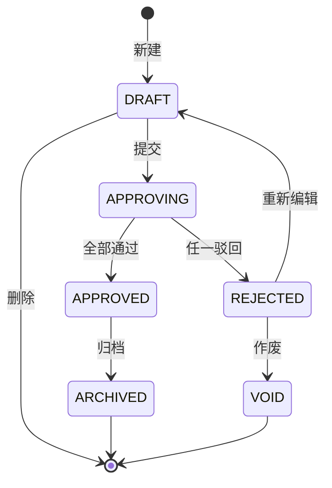

# PRD 输出规范（通用版 v1.0）

> 本规范是 PRD 文档的"骨架与样式"通用规范，提供跨项目可复用的 PRD 编写方法论。
> 适用对象：产品经理、产品架构师、需求文档编写人。
> 使用方式：直接遵循，或基于本规范定制项目专属子规范（详见 §一·定制指引）。
> 最后更新：2026-05-14 · v1.0

---

## 一、规范定位与定制指引

### 1.1 本规范解决什么问题

PRD 评审时常见痛点：

- 各模块文档结构不统一，评审人需反复适应不同骨架；
- 字段说明散落在多个章节，开发对不上需求与字段；
- 状态机有人画图、有人列表、有人写流程，开发不知道以哪个为准；
- 角色权限矩阵列表方向、标记符号各模块不同，难以一眼比对；
- 交互说明用散文描述，开发难以转化为时序图或测试用例。

本规范通过**强制骨架 + 结构化模板 + 严格标记体系**解决以上问题，让 PRD 在任何项目里都能"一眼对得上"。

### 1.2 本规范不解决什么问题

- ❌ 不规约接口定义、数据库设计等技术文档（另有规范）；
- ❌ 不规约具体业务术语、品牌字眼、编码规则（属项目专属，由项目子规范补充）；
- ❌ 不规约工程交付、测试用例、上线节奏等流程性内容。

### 1.3 如何基于本规范定制项目专属子规范

建议各项目在落地时新建一份"{项目名}-PRD 输出规范"，引用本规范作为 base，并在以下维度补充项目专属约束：

| 必须补充的维度 | 示例（仅供参考，非通用） |
|---|---|
| **品牌与术语字眼** | 唯一允许的品牌名、产品名、系统名；禁用词清单 |
| **业务编码规则** | 单据号格式、业务编码映射表（如 `RP=维修工单`） |
| **角色清单** | 项目内全部用户角色及其英文/中文映射 |
| **文件存放路径** | PRD 源文件、图片、附件的存放约定 |
| **特殊章节模板** | 项目特有的 PRD 章节模板（如看板类、报表类） |
| **评审 Checklist** | 项目特有的字眼合规、规则合规检查项 |

> **关键原则**：通用版只规约"骨架 + 方法"；项目专属约束（硬性合规、字眼禁用、编码映射）由子规范补充。
> 子规范开头应注明：`> 本规范继承自 PRD 输出规范-通用版 v1.0，以下为本项目专属约束。`

---

## 二、PRD 文件命名与存放

### 2.1 通用建议

| 项 | 建议规则 |
|---|---|
| 文件名 | `{两位序号}-{模块名}-PRD.md`，例：`01-用户管理-PRD.md` |
| 存放路径 | 由项目专属规范约定（建议统一目录，便于汇总） |
| 字符集 / 换行 | UTF-8 / LF |
| 文档语言 | 简体中文为主，专有英文术语（API / SLA / VIN 等）保留原文 |

每个模块 PRD **独立成文件**；最终汇总时按项目章节号映射插入。

### 2.2 版本号管理与迁移机制（强制）

**规范版本语义**（参照 SemVer）：

| 版本变更 | 触发条件 | 行为约束 |
|---|---|---|
| **patch**（v1.0 → v1.0.1） | 错别字、补充示例、措辞调整 | 存量 PRD 无需迁移 |
| **minor**（v1.0 → v1.1） | 新增可选章节 / 可选字段 / 非破坏性扩展 | 存量 PRD 可逐步采纳，不强制 |
| **major**（v1.x → v2.0） | 章节骨架增减、单元格标记体系变化、必填字段增减等破坏性变更 | 必须同步发布"迁移清单 + 迁移示例"，并标注受影响模块 |

> **重要原则**：破坏性变更必须升 major，不得在 patch / minor 里偷做。否则会导致存量 PRD 大量返工。

**模块 PRD 文件命名规则**：

- 默认形态：`{两位序号}-{模块名}-PRD.md`
- 当模块 PRD 因规范 **major** 升级而整体重写时，加 `-v{规范主版本号}` 后缀，例：`01-用户管理-PRD-v2.md`
- **旧文件保留为只读**，不删除，整体移入 `_archive/` 目录
- 同一模块在主目录下最多保留 1 份 active 版本

**版本声明（每份 PRD 必填）**：

```
> 遵循规范：PRD 输出规范-通用版 v1.0
> 文档版本：v1.0（YYYY-MM-DD，初版）
```

**规范升级 Checklist**：

- [ ] 在变更日志末尾附"**受影响模块**"清单
- [ ] 在变更日志末尾附"**迁移建议**"段（保持 / 需重写 / 可逐步迁移）
- [ ] 若是 major 升级，落地一份"v{X} → v{Y} 迁移示例"

**禁用做法**：

- ❌ 不要在 patch / minor 版本里偷做破坏性变更
- ❌ 不要直接覆盖已发布的 PRD 文件，应另存为 `-v{N}` 新版本，旧版归档
- ❌ 不要发布新规范却不附受影响模块清单与迁移建议

---

## 三、章节骨架（强制）

> 章节号约定：当 PRD 单独成 .md 时使用 `1 / 1.1 / 1.1.1` 起头；汇总进总文档时由编辑统一替换为项目约定的章节号（如 `5.X / 5.X.Y / 5.X.Y.Z`）。下文以 `{N}` 占位写法展示。

```
{N}    {模块名}-{端}                ← H2，模块入口
├── {N}.1  业务流                    ← H3，文字 + 流程图（必含一张泳道流程图）
├── {N}.2  角色权限                  ← H3，横向角色矩阵表
├── {N}.3  用户故事                  ← H3，四列用户故事表
└── {N}.4  功能说明                  ← H3
    ├── {N}.4.1  {功能1}             ← H4，单个功能；下接 7 段固定子目录
    ├── {N}.4.2  {功能2}
    ├── ...
    └── {N}.4.K  {功能K}
```

> **后置章节（可选）**：{N}.5 接口需求、{N}.6 非功能性需求、{N}.7 待确认事项、{N}.8 变更日志。
> "首模块"必填；后续模块若与首模块的非功能性 / 接口规范一致，可省略并标注 "复用首模块 §x"。

### 端的命名约定

| 端 | 后缀 | 示例 |
|---|---|---|
| PC 端 | `-PC端` | `订单管理-PC端` |
| 移动端 | `-手机端` 或 `-小程序` | `订单管理-手机端` |
| 跨端 | 不带端后缀 | `用户中心` |
| 看板/大屏 | `-看板` | `运营看板` |

---

## 四、各章节内容规范

### 4.1 {N}.1 业务流

**形态**：1 段引言文字（≤200 字，说明该模块业务的起止与上下游）+ 1 张端到端流程图（建议泳道图）。

**流程图要求**：

- 泳道分组：按角色或系统域划分（如 用户 / 客服 / 后台 / 系统自动 等）
- 节点形状：椭圆=起止，矩形=人工任务，菱形=判断，圆角矩形=系统任务
- 关键判断必须给出 Y/N 两路输出
- 输出文件类型：PNG（透明底）或在线绘图工具链接
- 命名建议：`_imgs/{模块缩写}-flow.png` + 同名 `.mmd` / `.drawio` 源文件

#### 4.1.1 状态机标准画法（强制）

> 痛点：各模块状态机有 4 列表 / 泳道 / Mermaid 三种写法，开发评审时对不上。本规范强制"**先泳道图，后状态表**"双段并列。

**第一段：状态泳道图**（Mermaid stateDiagram-v2 或图片）



**第二段：状态字段表**（4 列固定）

| 状态码 | 中文 | 进入条件 | 出口 |
|---|---|---|---|
| `DRAFT` | 草稿 | 新建保存 | 提交 → APPROVING；删除 → 销毁 |
| `APPROVING` | 审批中 | 草稿提交 | 全部通过 → APPROVED；任一驳回 → REJECTED |
| ... | ... | ... | ... |

**强制规则**：

1. 状态码建议从项目"主数据字典"取，禁止造同义词（"已完成 / 完结 / 已结案" 必须统一）
2. 每个状态都必须列出"**进入条件 + 出口**"，缺一不可
3. 终态用 `[*]` 标记，必须存在至少 1 个起点和 1 个终点
4. 同一状态码在不同模块**含义如有差异**，必须在表后写"差异说明"段
5. 状态切换的"操作人 + 触发条件"如复杂，单独成 "{N}.1.1 状态切换详表"

### 4.2 {N}.2 角色权限

**形态**：横向角色矩阵表（角色作为列，功能作为行，单元格用 ✅ 或留空标注）。

**列定义（强制顺序）**：

| 列 | 列名 | 说明 |
|---|---|---|
| 1 | 模块 | 业务子域分组，相同子域跨行合并（rowspan） |
| 2 | 核心功能 | 该子域下的具体功能名 |
| 3+ | {角色1}{角色2}… | 每个用户角色一列 |

**单元格写法（极简 · 强制）**：

| 标记 | 含义 |
|---|---|
| ✅ | 该角色对该功能可见 / 可操作 |
| 空白 | 不可见 / 不可操作 |

**示例**：

| 模块 | 核心功能 | 角色A | 角色B | 角色C |
|---|---|:--:|:--:|:--:|
| 订单管理 | 订单查询 | ✅ | ✅ | ✅ |
| 订单管理 | 订单导出 | ✅ | ✅ |  |
| 订单管理 | 订单审核 |  | ✅ |  |
| 订单管理 | 订单作废 |  |  | ✅ |

**如需表达"数据范围"或"操作差异"，通过行名拆分实现**：

- **数据范围差异**：把"订单查询（本部门）"和"订单查询（全公司）"拆成两行，分别勾选对应角色；
- **操作差异**：把"订单审核""订单驳回""订单作废"分行列出，谁能做哪一步一目了然。

**禁用做法**：

- ❌ 不要把"功能"做成列、"角色"做成行（与本规范模板相反）；
- ❌ 不要使用 Y / V / — 字母矩阵（已废止）；
- ❌ 不要使用 R / W / E 等复合权限标记（实测复杂难读，已废止）；
- ❌ 不要使用 ✅（仅个人）/ ✅（仅本店）等带括号限定（应改为行名拆分）。

### 4.3 {N}.3 用户故事

**形态**：4 列表格。每行对应一个 (用户角色, 功能需求束) 组合；同一角色多条需求时，"用户角色"列跨行合并。

**列定义（强制顺序）**：

| 列 | 列名 | 写法要求 |
|---|---|---|
| 1 | 用户角色 | 形如"前台-业务员" / "后台-审核员" / "客户端-普通用户"；rowspan 合并 |
| 2 | 功能需求 | • 起头的项目符号清单，每条短句陈述"能够 xxx" |
| 3 | 需求价值 | • 起头的项目符号清单，"快速 / 提升 / 全面 / 把控 / 确保…" 句式 |
| 4 | 验收标准 | 子域加粗作为段头，下接 • 起头的项目符号清单 |

**示例骨架**：

| `用户角色`   | `功能需求`                                                                  | 需求价值                                                         | 验收标准                                                                                                            |
| ------ | --------------------------------------------------------------------- | ------------------------------------------------------------ | --------------------------------------------------------------------------------------------------------------- |
| 前台-业务员 | • 能够在订单列表通过订单号、客户名、日期等筛选订单<br>• 能够查看、修改订单详情，录入物流信息<br>• 能够创建退款单，关联原订单 | • 快速定位需处理的订单，提升效率<br>• 全面记录订单信息，为后续追溯提供依据<br>• 基于订单生成退款，明确金额 | **订单列表**<br>• 可查看本人所属订单列表，支持订单号、客户名、日期段筛选<br>• 多条件筛选后能准确展示订单列表<br>• 可进入订单详情页…<br>**退款单**<br>• 可基于订单创建退款，金额自动带出… |

**编写要点**：

- 每条"功能需求"建议 30 字内
- "验收标准"以子域加粗段头分组，每段 3~6 条
- 字数控制：单角色总条目 ≤ 20

### 4.4 {N}.4 功能说明

**形态**：本章节作为外层壳；下挂 N 个具体功能（`{N}.4.1`、`{N}.4.2`、…），每个功能严格遵循下文 7 段固定结构。

#### 4.4.1 单个功能的 7 段固定子目录（强制）

```
{N}.4.K  {功能名}
   1. 菜单路径
   2. 原型图
   3. 功能说明
   4. 数据说明
   5. 交互说明
   6. 导入导出模版
   7. 异常场景说明
```

> 在 Markdown 源文件中，这 7 段使用有序列表（`1. xxx`）而非 H5 标题；这样导出 Word 后会自动呈现为蓝色编号项目。

| 段 | 内容要求 | 缺失处理 |
|---|---|---|
| 1 菜单路径 | 完整 PC / 移动端菜单路径，如 `PC端首页-订单中心-订单管理-订单列表` | 必填 |
| 2 原型图 | 嵌入原型图（PNG / Axure / Figma 链接 / 本仓库 prototype 路径）；附"截图说明 1~5 句话" | 必填 |
| 3 功能说明 | **按页面区块拆分**：用【区块名】聚合该区块下所有"字段 / 限制 / 默认值 / Toast 文案 / 校验规则 / 状态变更"细节，详见 4.4.4 模板 | 必填，每个区块至少 1 条主项 + 2 条子项 |
| 4 数据说明 | 字段清单表（见 4.4.2） | 必填 |
| 5 交互说明 | 用户在该功能下的主要操作路径、关键页面跳转、表单校验规则；**不展开到每个按钮级别** | 必填 |
| 6 导入导出模版 | 是否支持导入 / 导出，模板字段，及大数据量异步导出阈值 | 不涉及时填"暂无" |
| 7 异常场景说明 | 业务层面的典型异常：如数据缺失时如何展示、权限不足时如何处理、跨模块联动失败时的 fallback。**不写技术异常（网络超时/并发锁）** | 必填，至少 3 条 |

#### 4.4.2 数据说明字段清单（面向产品经理，5 列）

| 字段名称 | 数据来源 | 数据类型 | 是否必填 | 业务规则 |
|---|---|---|---|---|
| 订单编号 | 系统自动生成 | 文本 | 是 | 18 位定长，规则：`{业务前缀}+{日期}+{流水号}` |
| 下单日期 | 系统默认 | 日期 | 是 | 默认当天，支持手工修改 |
| 订单金额 | 用户录入 | 金额 | 是 | 精确到分，最高 999,999.99 元 |
| 订单状态 | 系统计算 | 选项 | 是 | 待支付 / 已支付 / 已发货 / 已完成 / 已取消 |

**列说明**：

- **数据来源**：该字段的值从哪里来（用户录入 / 系统生成 / 从 XX 模块自动带入 / 外部系统回传）
- **数据类型**：用业务语言写（文本 / 数字 / 金额 / 日期 / 日期时间 / 选项 / 附件 / 长文本），**不写** `String(18)` / `Decimal(12,2)` 等技术类型
- **业务规则**：怎么生成、怎么校验、有什么限制条件、与别的字段什么关系、枚举值有哪些。**这是核心列，要写清楚**
- **不写"字段代码"、不写"是否显示"**（除非该字段在特定条件下隐藏，才在业务规则里注明）

#### 4.4.3 交互说明结构化模板（强制）

> **背景**：散文式描述导致开发拿不到清晰的时序。本规范要求改用「**【操作名】+ 箭头链**」格式，把每个用户动作的"用户操作 → 系统响应 → 落库 → 通知"显式画出来。

**编写规则**：

1. **块标题**：用中文方括号 `【操作名】` 聚合每个独立用户动作（如【提交订单】【取消订单】【发起退款】），原型上每个独立按钮 / 入口对应一个块。
2. **箭头链**：每条 `- ` 项目用 `→` 串起多个步骤，写"**主体 + 动作**"，每条 2~5 个步骤；末尾 `→` 表示与下一条延续，没有 `→` 表示该条是终态。
   - 主体可为：用户、系统、原处理人、新处理人；
   - 系统类动作允许写"系统验证…""系统监控…""自动生成…""通知…"。
3. **必含步骤层次**：每个操作至少覆盖三层 — 用户触发 → 用户填写 / 选择 → 系统校验 / 落库 / 通知。
4. **【异常】专块**：每个功能末尾必须有【异常】块，列出 2~5 类异常，每类异常用 3 个加粗子标签描述：
   - **场景**：什么情况下会发生
   - **处理**：系统如何处理（机制层面）
   - **解决** / **审计**：用户能怎么继续 / 系统留什么底
5. **箭头链示意符号**：固定使用全角箭头 `→`（不要用 `->` 或 `=>`）；步骤间用空格分隔。
6. **粒度上限**：单操作 5~8 条；超过 8 条说明拆得太细，应抽到子操作或合并。

**完整模板**：

```
5. 交互说明

【操作1】
- 用户点击"操作1"按钮 → 打开操作弹窗 →
- 选择 xxx → 输入 xxx → 上传 xxx →
- 点击保存 → 系统验证必填项 → 落库 →
- 更新页面状态 → 通知相关责任人

【操作2】
- ...

【预警 / 自动化】（系统自动触发的动作单独成块）
- 系统监控 xx 状态 → 达到预警阈值 →
- 自动生成预警记录 → 触发预警通知 →
- ...

【异常】
- **操作冲突**
  - 场景：多用户同时操作同一单据导致状态冲突
  - 处理：采用乐观锁机制，后操作者提示状态已变更
  - 解决：显示状态对比，支持强制刷新后重新操作
- **权限变更**
  - 场景：操作执行时用户权限发生变化
  - 处理：操作前验证权限，无权限操作自动拒绝
  - 审计：记录所有权限变更导致的操作失败日志
```

**禁用写法**：

- ❌ 不写"操作按钮 ≤ 4 + 更多"这类 UI 样式规则（归原型规范管）
- ❌ 不展开到具体 UI 控件级别（如"勾选 checkbox""滑动 slider"），只到"选择 xxx""输入 xxx"
- ❌ 不使用代码术语：`chip`、`form`、`API`、`JSON`、`statusCode`、`APPROVING` 等
- ❌ 不写"操作日志记录某某动作"（系统级通用能力，不由 PRD 定义；除非业务侧明确要审计的动作，再写到【异常】的"审计"行）
- ❌ 不要把所有操作合并到一个【操作流程】大块；每个独立按钮 / 入口必须独立成块

#### 4.4.4 功能说明结构化模板（强制）

> **背景**：早期"≥500 字业务逻辑叙述"的写法，导致开发评审时找不到具体字段限制、Toast 文案、校验规则。本规范要求按**页面区块**结构化拆解，让每个 UI 区块的"字段 / 默认值 / 限制 / 校验 / Toast / 状态转换 / 上传规则"逐条落到纸上。

**编写规则**：

1. **区块标题**：使用中文方括号 `【区块名】`，每个 UI 上能直观识别的功能区一个块（如"选择客户""订单信息""添加附件""数据验证""单据状态管理"）。
2. **主项**：每个区块下用 `- ` 列出该区块的主要交互点（一行一条；动名词开头："限制 xx""默认 xx""支持 xx"）。
3. **子项**：缩进两格 `  - `，挂在主项下；用于写**限制 / 默认值 / Toast 文案 / 校验异常 / 状态转换**等细节。最多两层嵌套。
4. **顺序**：选择类输入 → 信息预填 → 用户输入 → 文件上传 → 单据创建 / 状态 → 数据验证。最后一块固定为「**数据验证**」（即使前面已分散提过校验，也要在尾部汇总）。
5. **Toast / 提示文案**：直接写中文双引号包住的最终文案，例如 `Toast 文案为："请选择服务类型"`，禁止写"提示用户XXX"这种模糊描述。
6. **不要重复"4 数据说明"**：字段表归"数据说明"段，"功能说明"只写**字段在 UI 层的行为**（默认值、是否可编辑、上限、文案）。

**字数 / 颗粒度参考**：单功能 6~12 个区块，每个区块 3~8 条；总长度 800~1500 字。

**完整模板**：

```
3. 功能说明

【{区块1：选择类输入}】
- {主项 1.1}
  - {限制 / 默认值}
  - {Toast 文案为："xxx"}
- {主项 1.2}
  - ...

【{区块2：信息预填 / 联动}】
- ...

【{区块3：用户主动输入}】
- 字数限制 / 必填规则 / 输入框下方文案
  - 未输入：placeholder 为"xxx"
  - 已输入：xx
  - 字数超限：已输入字数变红，示例 201/200

【{区块4：附件 / 上传}】
- 数量上限 / 体积压缩 / 顺序保持
  - 上传失败：弹窗"xxx"，允许重试或放弃
  - 预览：放大至全屏，可缩放，关闭按钮回退

【{区块5：单据创建与状态管理}】
- 生成单据号规则
- 默认初始状态
- 推送其他端的时机

【数据验证】
- 必填项：标 * 字段为必填，保存前校验完整性
- 格式校验：电话号码、身份证号等符合规范格式
- 业务校验：内部接口查询【xxx】数据，仅可选 xxx
- 唯一性：限制 xx 在同一 xx 仅限一条
```

#### 4.4.5 标准样例（通用版）：订单详情功能说明

```
3. 功能说明

【选择客户】
- 点击【选择客户】，展示客户列表
- 客户列表搜索栏，可通过客户姓名 / 手机号 / 客户编号等关键信息进行搜索查询（支持模糊查询）
- 联系人信息：选择客户后，联系人姓名和手机号自动填入（允许修改 / 重新选择）
  - 若在选择客户之前就填写了联系人信息，选择客户后，不更改已填写好的联系人

【订单信息】
- 订单类型
  - 读取系统配置字段
  - 不默认选中，用户可以选择单个或多个订单类型
  - 具有必填性校验，未选择时点击提交按钮系统需提示，Toast 文案为："请选择订单类型"
- 期望交付时间
  - 已被排满的时间段不可选择
  - 若选择的时间段已被占满或不符合选择条件，系统提示用户重新选择
- 备注内容
  - 限制字数 200 以内
  - 在输入框下方显示已输入的字数和最大字数限制，示例：99/200
  - 字数超过 200 时，已输入字数变红，示例：201/200

【添加附件】
- 限制上传附件的数量为 9 个，附件上传的顺序需与用户上传时选择的顺序一致
- 可点击附件右上角的删除图标移除附件，后序附件往前顺移
- 用户图片压缩至 2MB 每张，存储图片链接，系统间同步以图片链接传输
- 在上传过程中出现错误时，弹出弹窗：附件上传失败
- 允许用户在上传失败后重新尝试上传或放弃上传

【单据创建与状态管理】
- 生成唯一订单号，订单信息推送至客户端，单据默认为"待处理"状态

【数据验证】
- 必填项验证：标 * 字段为必填，保存前校验完整性
- 格式验证：电话号码、邮箱等符合规范格式
- 期望交付时间：通过内部接口查询【容量】数据，仅可选择有余量的时段
- 限制同一客户同一商品仅限一条有效订单
```

---

## 五、可选后置章节（{N}.5 ~ {N}.8）

| 章节 | 形态 | 必填规则 |
|---|---|---|
| {N}.5 接口需求 | 表：编号 / 名称 / 方向 / 说明 | 模块涉及外部系统对接时必填 |
| {N}.6 非功能性需求 | 表：维度 / 指标 | 首模块必填，后续模块复用首模块即可 |
| {N}.7 待确认事项 | 表：序号 / 事项 / 影响 / 推进 | 至少 1 条；用于评审后留底 |
| {N}.8 变更日志 | 表：日期 / 版本 / 变更内容 / 编写人 | 必填，每次评审后追加一行 |

---

## 六、项目专属约束扩展点

> 本规范只规约通用骨架。各项目应在子规范中补充以下专属约束：

### 6.1 品牌与术语字眼规范（项目子规范填充）

建议项目在子规范中以下表形式固化：

| 项 | 唯一允许值 | 备注 |
|---|---|---|
| 品牌 | {项目唯一品牌名} | 全部 PRD、字段示例、Mock 数据中均不得出现其他历史品牌字眼 |
| 产品名 / 系统名 | {项目产品名} | 不再使用旧名称 |
| 行业术语 | 列出本项目使用的标准术语清单 | — |

**评审前必须对 PRD 文件做字眼 grep 检查，禁用词命中数须为 0**。

### 6.2 单据/业务编码规范（项目子规范填充）

**通用编码格式建议**：`{业务前缀}{日期戳}{流水号}` 或 `{组织编码}{日期戳YYMMDD}{业务编码}{流水号}`

各项目应在子规范中：

1. 明确编码总长度（建议定长，便于数据库索引）
2. 列出业务编码映射表（如 `RP=维修工单`、`PD=取送车`）
3. 约定新增单据类型的申请流程
4. PRD 中字段说明须明确写出编码规则示例

### 6.3 操作项展示规范（推荐）

1. **位置**：操作项按钮放在**单据编号字段后面**
2. **数量限制**：默认最多展示 **4 个按钮**
3. **更多按钮**：超过 4 个时，第 4 位显示为【更多】
4. **展开方式**：点击【更多】展开下拉菜单

**按钮优先级**：

1. 查看（必显示）
2. 编辑 / 处理（高频）
3. 状态变更类（审核 / 派发 / 完工）
4. 【更多】（收纳低频操作）

---

## 七、PRD 评审 Checklist（提交前自检）

**骨架结构**：

- [ ] 模块标题为 `{N} {模块名}-{端}` 格式
- [ ] 包含 {N}.1 业务流（含流程图）
- [ ] 包含 {N}.2 角色权限（横向角色矩阵）
- [ ] 包含 {N}.3 用户故事（4 列表）
- [ ] 包含 {N}.4 功能说明（每个功能 7 段固定子目录）
- [ ] 各功能的"数据说明"为 5 列字段清单表（字段名称/数据来源/数据类型/是否必填/业务规则），无字段代码
- [ ] 必含 {N}.8 变更日志

**字眼合规**（按项目子规范执行）：

- [ ] 全文 grep 项目禁用词清单，结果为 0
- [ ] 全部品牌 / 产品 / 系统字眼符合项目子规范

**业务规范**：

- [ ] 涉及单据均使用项目约定的编码格式
- [ ] 每个功能列表的操作按钮 ≤ 4 + 更多
- [ ] 状态、颜色、空状态文案与项目规范一致

**附属**：

- [ ] 流程图等图片已落在 `_imgs/` 下，命名规范
- [ ] 在项目"PRD 输出清单"中将状态从 ⏳ 改为 ✅

---

## 八、特殊形态 PRD 子规范（按需扩展）

不同形态 PRD 在第三章骨架基础上，可额外要求专属内容：

| 形态 | 额外要求 |
|---|---|
| **看板类 PRD** | {N}.4.K 功能下补足"泳道模型 / 卡片字段 / 操作权限矩阵 / 接口基线"四块 |
| **报表类 PRD** | {N}.4.K 功能下补足"指标定义 / 数据口径 / 取数 SQL 注释 / 钻取路径"四块 |
| **大屏类 PRD** | {N}.4.K 功能下补足"屏幕尺寸 / 刷新频率 / 数据兜底 / 多端适配"四块 |
| **配置类 PRD** | {N}.4.K 功能下补足"配置项清单 / 默认值 / 生效范围 / 回滚机制"四块 |

各项目可根据实际需要在子规范中扩展。

---

## 九、骨架样例（最简可用）

```markdown
# {模块名} - 产品需求文档

> 遵循规范：PRD 输出规范-通用版 v1.0
> 文档版本：v1.0（YYYY-MM-DD，初版）
> 编写人：{姓名}

## {N} {模块名}-PC端

### {N}.1 业务流
{200 字以内引言}


### {N}.2 角色权限

| 模块 | 核心功能 | 角色A | 角色B | 角色C |
|---|---|:--:|:--:|:--:|
| 子域A | 功能a（本人） | ✅ |   |   |
| 子域A | 功能a（本部门） |   | ✅ |   |
| 子域A | 功能a（全公司·只读） |   |   | ✅ |

### {N}.3 用户故事

| 用户角色 | 功能需求 | 需求价值 | 验收标准 |
|---|---|---|---|
| 前台-业务员 | • 能够……<br>• 能够…… | • 提升……<br>• 快速…… | **子域A**<br>• 验收点 1<br>• 验收点 2<br>**子域B**<br>• 验收点 3 |

### {N}.4 功能说明

#### {N}.4.1 {功能1}

1. 菜单路径：PC端首页-{业务域}-{模块}-{功能}
2. 原型图：
3. 功能说明：……（按 4.4.4 模板分【区块】写）
4. 数据说明：

   | 字段名称 | 数据来源 | 数据类型 | 是否必填 | 业务规则 |
   |---|---|---|---|---|
   | 单据号 | 系统自动生成 | 文本 | 是 | 见项目子规范「单据编码规范」 |

5. 交互说明：……（按 4.4.3 模板分【操作】+ 箭头链写）
6. 导入导出模版：支持 / 暂无
7. 异常场景说明：……

#### {N}.4.2 {功能2}
（同上）

### {N}.5 接口需求（如有）

### {N}.6 非功能性需求（如复用首模块，写"复用 {N}.6"）

### {N}.7 待确认事项

| 序号 | 事项 | 影响 | 推进 |
|---|---|---|---|
| Q1 | … | … | … |

### {N}.8 变更日志

| 日期 | 版本 | 变更内容 | 编写人 |
|---|---|---|---|
| YYYY-MM-DD | v1.0 | 首版 | {姓名} |
```

---

## 十、变更日志

| 日期 | 版本 | 变更内容 | 编写人 |
|---|---|---|---|
| 2026-05-14 | v1.0 | 基于"示例项目 EXAMPLE PRD 输出规范 v2.2"抽离方法论，输出对外通用版。<br>**保留**：版本管理 / 章节骨架 / 7段式功能说明 / 状态机双段 / 单元格标记体系 / 字段命名 / 交互说明结构化模板 / 评审 Checklist<br>**剥离**：示例项目/X9/EXAMPLE等品牌字眼 / 18位编码业务映射表 / 项目专属角色名 / 文件路径硬编码<br>**新增**：§1.3 定制指引、§6 项目专属约束扩展点、§8 特殊形态 PRD 子规范 | 阿莫西林 |

---

## 附：使用本规范的常见问题

**Q1：本规范能直接拿来给我们项目用吗？**

A：可以。但建议先建一份"{项目名}-PRD 输出规范"作为子规范，引用本规范作为 base，并补充项目专属约束（品牌字眼、编码规则、角色清单等）。这样后续规范升级时，子规范只需改自己的部分，骨架自动跟进。

**Q2：我们项目章节号不是 5.X，能用吗？**

A：可以。本规范用 `{N}` 占位章节号，各项目按自己的文档体系替换即可（如 4.X / 5.X / 6.X 都行）。骨架结构（业务流 / 角色权限 / 用户故事 / 功能说明）保持不变即可。

**Q3：7段式功能说明能简化吗？**

A：不建议。7 段对应了"在哪用 / 长啥样 / 业务规则 / 字段定义 / 操作时序 / 数据交换 / 异常处理"七个开发关注维度，缺一段就有维度漏写。如果某段实在不涉及（如"导入导出"），写"暂无"即可，不要删段。

**Q4：状态机一定要画 Mermaid 吗？**

A：不强制 Mermaid，但**强制双段并列（图 + 表）**。图可以是 Mermaid、PlantUML、draw.io、Figma 截图，关键是必须能展示状态流转关系。表必须是 4 列固定（状态码 / 中文 / 进入条件 / 出口）。

**Q5：单元格标记一定要 ✅/空白 二值吗？**

A：是的。早期试用过 R/W/E、✅（仅本店）等复杂标记，业务侧反馈"歧义没减少、阅读成本反增"。本规范固化为 ✅/空白 二值后，权限差异通过"行名拆分"表达，反而更清晰。
