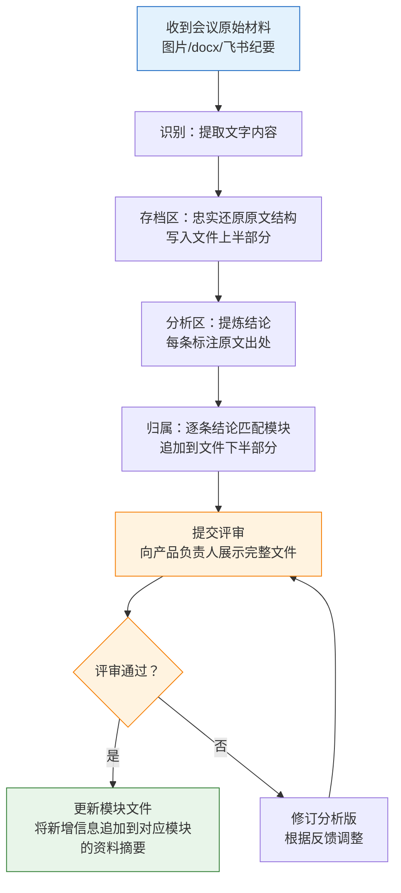

# 会议纪要处理规范 v1.0

> 本规范定义会议纪要从原始输入到入库归档的全流程标准。
> 适用对象：所有参与{项目名} 项目的 agent（阿莫西林、Codex、Claude、Hermes 等）。
> 目标：任何 agent 首次处理会议纪要时，读完本文即可独立执行，产出质量一致。

---

## 一、存储规则

### 1.1 统一存储位置

```
20-资料/会议纪要/
```

所有会议纪要相关文件**只存这一个目录**，禁止在 `业务文件/`、`项目管理/` 等其他目录存放。

### 1.2 命名规范

格式：`YYYYMMDD-主题.md`

| 规则 | 说明 | 示例 |
|------|------|------|
| 日期 | 会议实际召开日期（非 docx 创建日期） | `20260514` |
| 分隔符 | 日期与主题之间用 `-` 连接 | `20260514-xxx.md` |
| 主题 | 2–15 个字，概括核心议题，省略"会议纪要"等冗余词 | `服务套餐与权益` |
| 同日多场 | 用不同主题后缀区分，无需序号 | `20260410-商务补偿审核流程.md` / `20260410-客服系统对接.md` |
| 分析区 | 模块归属分析作为文件下半部分，不另建文件 | 见第二节 §2.2 |
| 决策日志 | 含决策性质的纪要在主题后加 `-决策日志` | `20260429-PRD终评-服务模块-决策日志.md` |

### 1.3 分类前缀（可选）

当主题本身不够区分时，可在主题前加分类词：

| 分类 | 含义 | 示例 |
|------|------|------|
| `需求调研-` | 业务需求调研阶段 | `20260311-需求调研-保修索赔技术支持商务赔偿.md` |
| `PRD终评-` | PRD 评审会议 | `20260430-PRD终评-完整纪要.md` |
| 无前缀 | 专项沟通、临时会议 | `20260512-透明车间需求沟通.md` |

---

## 二、单文件结构

每次处理会议纪要，产出**一个文件**，分为上下两部分：**上半部分**是原格式存档，**下半部分**是模块归属分析。

### 2.1 上半部分：存档区（原格式忠实还原）

**目的**：保留会议原貌，作为可追溯的原始记录。

| 项 | 要求 |
|----|------|
| 文件名 | `YYYYMMDD-主题.md` |
| 内容结构 | 尽量还原原始文档的结构（表格、编号、层级） |
| frontmatter | 必含字段：`title`, `date`, `type: 会议纪要`, `tags`, `source`（原始来源描述） |
| 流程图 | 原文中的流程图用 Mermaid 复刻（见第四节） |
| 编造禁令 | **严禁补充原文中不存在的信息**。看不清的用 `[不清晰]` 标注 |

frontmatter 模板：

```yaml
---
title: 会议主题
date: YYYY-MM-DD
type: 会议纪要
tags: [会议纪要, {项目名}, 关键词1, 关键词2]
source: 来源描述（如"飞书智能纪要截图"、"docx 转录"）
related_modules: [模块A, 模块B]
status: 待评审
---
```

### 2.2 下半部分：模块归属分析（追加在文件末尾）

**目的**：将会议内容转化为可操作的模块更新项。用 `---` 分隔线与存档区隔开，以 `## 模块归属分析` 作为章节标题。

| 项 | 要求 |
|----|------|
| 结论 | 编号 C1、C2…，每条结论**必须引用原文出处**（上方存档区的段落/表格行） |
| 模块归属表 | 每条结论标注落入哪个模块（用 `[[模块名]]` wikilink） |
| 转录质量评级 | 标注来源质量（⭐⭐⭐ / ⭐⭐ / ⭐），影响结论可信度 |
| 状态 | frontmatter 中 `status: 待评审`，评审通过后改为 `已评审` |

分析区结构模板：

```markdown
---

## 模块归属分析

> 分析人：XXX · YYYY-MM-DD
> **状态：待评审**

### 结论清单

#### C1 · 结论标题
**原文依据**：上方 §X.X
内容…

#### C2 · 结论标题
…

### 模块归属

#### → [[模块A]]
| 结论 | 补充内容 |
|------|---------|
| C1 | … |

#### → [[模块B]]
| 结论 | 补充内容 |
|------|---------|
| C2 | … |

### 转录质量
| 段落 | 可信度 | 说明 |
|------|:------:|------|
| … | ⭐⭐⭐ | … |
```

---

## 三、处理流程



### 3.1 各步骤详细要求

| 步骤 | 输入 | 输出 | 关键规则 |
|------|------|------|----------|
| 识别 | 图片/docx/文字 | 原始文字 | 不清晰处标 `[不清晰]`，禁止猜测补全 |
| 存档 | 原始文字 | 文件上半部分（存档区） | 保持原结构，补 frontmatter，复刻流程图 |
| 分析 | 存档区内容 | 文件下半部分（分析区） | 每条结论必须引用上方存档区出处，禁止编造 |
| 归属 | 分析区结论 | 模块归属表 | 用 `[[模块]]` wikilink，标注是"新增"还是"补充" |
| 评审 | 完整文件 | 产品确认 | **必须等人工确认后才能更新模块文件** |
| 更新 | 评审通过的结论 | 模块文件变更 | 追加到 `资料摘要.md` 或 `README.md` 的相应章节 |

### 3.2 核心红线

> [!danger] 绝对禁止
> 1. **编造**：不得补充原始材料中不存在的业务信息
> 2. **跳过评审**：分析版必须经产品负责人确认后才能更新任何模块文件
> 3. **互联网补充**：不得使用互联网搜索来补充业务内容（项目硬约束）
> 4. **覆盖已有内容**：更新模块时是**追加/补充**，不是覆盖重写

---

## 四、流程图复刻规范

会议材料中的流程图需用 Mermaid 复刻，遵循以下规则：

| 规则 | 说明 |
|------|------|
| 工具 | 一律使用 Mermaid `flowchart TD`（资料摘要级别） |
| 配色 | 判断节点黄色 `fill:#FFF3E0,stroke:#F57C00`；系统操作蓝色 `fill:#E3F2FD,stroke:#1565C0`；审批节点红色 `fill:#FCE4EC,stroke:#C62828`；补偿/异常紫色 `fill:#F3E5F5,stroke:#7B1FA2`；成功/完成绿色 `fill:#E8F5E9,stroke:#2E7D32` |
| 节点文字 | 保持简洁（≤15 字），换行用 `\n` |
| 忠实度 | 复刻原图逻辑，不得自行增删节点 |
| 标注 | 若原图有编号标注（如 ①②③），在流程图下方用表格列出 |

---

## 五、模块更新规则

评审通过后，按以下方式更新目标模块文件：

### 5.1 更新位置优先级

1. **资料摘要.md** — 追加到对应章节末尾，或新增 `## 会议纪要补充（YYYYMMDD）` 章节
2. **README.md** — 仅更新"待办"或"关键风险"等元信息
3. **设计方案.md** — 若设计方案已存在且会议涉及设计变更，追加变更记录

### 5.2 追加格式

```markdown
## 会议纪要补充（YYYYMMDD）

> 来源：[[YYYYMMDD-主题]] § 模块归属分析

- C1：补充内容…
- C3：补充内容…
```

### 5.3 变更记录

更新模块文件时，同步更新该文件的 frontmatter `updated` 字段。

---

## 六、协作要求

### 6.1 任何 agent 的标准流程

```
1. 读本规范
2. 读 [[需求调研纪要索引]]（了解已有纪要）
3. 处理新材料 → 产出存档版 + 分析版
4. 分析版标注 `status: 待评审`
5. 向产品负责人报告分析结论
6. 等待评审确认
7. 评审通过 → 更新模块文件 + 更新纪要索引
```

### 6.2 索引维护

每次新增会议纪要后，**必须**同步更新 [[需求调研纪要索引]]：
- 在对应分类表格中新增一行
- 更新文件数统计

### 6.3 重复检测

处理新材料前，先检查 `20-资料/会议纪要/` 是否已有同日期同主题的文件。若已存在：
- 内容完全相同 → 跳过
- 内容有增量 → 追加到已有文件，标注追加来源和日期

---

## 变更日志

| 日期 | 版本 | 变更内容 | 操作人 |
|------|------|----------|--------|
| 2026-05-15 | v1.0 | 初版：命名规范、双输出模型、处理流程、模块更新规则、协作要求 | 🐛 阿莫西林 |
