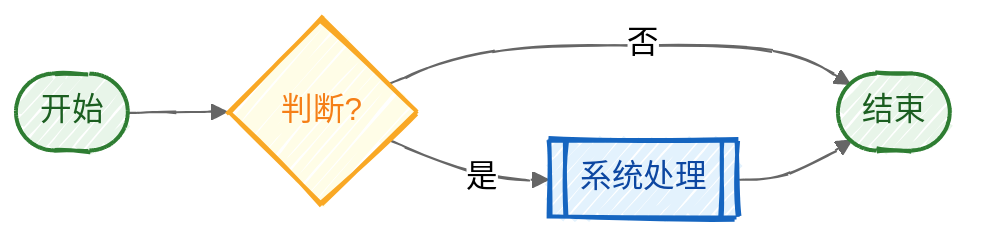

# 流程图绘制规范 v3.4.4

> **本规范是一个生成算法。** 从 Step 0 到 Step 6 顺序执行，每一步的输出是下一步的输入。按步骤走完 = 合规的 drawio；需要同步到飞书画板时，再执行”附录 H · 飞书画板绘制与发布规范”。
>
> v3.3.2 增加端点真实吸附、端口方向、显式路由计划和渲染复核，消除“看似连接、实际悬空”的边及自动路由回形问题。
>
> v3.3.7 增加矩阵流程图区域边界、预期业务连线数、检核器降级硬失败和 200% 局部证据图，避免把“未识别连接器”误判成“零错误通过”。
>
> v3.3.8 增加飞书原生对象硬门禁：矩阵底板使用单一原生表格，节点文字必须内嵌，连接器两端必须绑定对象端口，禁止用 SVG 组合冒充可编辑流程图。
>
> v3.3.9 将“飞书原生能力”提升为所有正式飞书流程图的总原则：无论简单流程、泳道流程还是矩阵流程，最终画板均须由原生图形、原生文字、原生表格/泳道和原生连接器构成；Mermaid、PlantUML、DSL、SVG 仅作为生成中间稿或视觉诊断产物。
>
> v3.4.0 增加流程图分级：一级主流程泳道图优先保障流程阅读与路由空间，二级 PRD 矩阵流程图在同一流程样式上叠加业务规则、功能名称和备注框架；两级共用同一套节点、判断、连线和正交路由语言。
>
> v3.4.1 增加全图可读性硬门禁：限制流程区最大宽度和相邻主干节点最大宽距，规定飞书节点最低字号，并用 1600px 全图预览的等效字号验收，避免出现“结构校验通过但实际无法阅读”。
>
> v3.4.2 将语义、几何与布线规则落成可执行工具：模板作为版本化参考参数持续演进，验收规则作为稳定门禁；新增A0业务语义验收、A1飞书raw几何验收和ELK辅助复杂状态流布局，FAIL时停止正式画板写入。

> v3.4.3 使用取送车与道路救援真实业务样本验证布局器：复杂状态流升级为节点感知正交布线，优先0~2次转折，外围回路最多4次；固化飞书真实写入所需的字符串表格标题与文本主题色代码；交叉、重叠、穿节点、短折和错误端口仍为硬失败。

> v3.4.4 增加“参考白板优先”执行门禁：用户提供飞书原始示例白板时，必须先回读参考 raw 并量化对象模型、表格结构、节点几何、字号、连接器绑定与路由指标；不得把示例降级为视觉参考。补充飞书 raw 写入格式契约与交付摘要硬指标，避免 API 成功但预览占位、结构 PASS 但视觉不合格。

---

## Step 0 -- 输入收集

在写任何 XML 之前，先把流程结构化为以下格式：

```yaml
title: "流程名称"
actors:              # 参与角色/系统
  - id: actor-id
    name: "显示名"
    type: primary|system|external|third-party|customer|neutral
nodes:               # 所有节点
  - id: n-xxx
    actor: actor-id  # 模式 A 必填；模式 C（状态图）可省略
    label: "节点文字"
    type: start|end-ok|end-cancel|core|normal|decision|exception|sla|data|status
edges:               # 所有连线
  - source: n-xxx
    target: n-yyy
    type: main|branch|reject|async|approve|sla
    label: ""        # 判断出口必填条件文字，其他可选
decisions:           # 判断节点的全部出口（强制 >=2，每条必须有 condition）
  - node: n-xxx-q
    outputs:
      - condition: "是"       # 必填，不得为空
        target: n-yyy
        type: main
      - condition: "否"       # 必填，不得为空
        target: n-zzz
        type: branch
```

> **字段命名约束**：全规范统一使用 `source/target`（不使用 `from/to`）。
> `decisions.outputs` 是 YAML 层面的预声明；最终校验以 drawio XML 中 `<mxCell>` 的 `value` 属性为准（见 Step 6 V3）。

**类型映射速查**：

| 层 | 字段 | 可选值 | 样式出处 |
|---|------|--------|---------|
| actor.type | 业务语义 | primary, system, external, third-party, customer, neutral | 附录 B |
| node.type | 业务语义 | start, end-ok, end-cancel, core, normal, decision, exception, sla, data, status | 附录 A |
| edge.type | 业务语义 | main, branch, reject, async, approve, sla | 附录 C |

**检查点**：
1. 每个 `type: decision` 的节点在 `decisions` 列表中有 >= 2 个 outputs？
2. 每个 output 的 `condition` 非空？
3. `edges` 中所有 `source/target` 引用的 id 在 `nodes` 中存在？

全部通过则进入 Step 1。

---

## Step 1 -- 选型决策

> **PRD 底线约束（来自 [[示例项目PRD硬约束-v3.3]] §7，优先级高于本规范）**：
> - 单图横向泳道 ≤ 7 个（超出必须拆分）
> - 节点文字必须是中文业务概念（动词短语），禁止英文代码名
> - 输出必须是 `.drawio` 源文件（禁止仅用 PNG/mermaid 替代）
> - AI 生成初稿后，人工必须在 diagrams.net 中微调 waypoints（见 §6.3）
> - 模式 A 的节点写中文动词短语；模式 C 的状态节点写中文名词，并配套状态字段表

### 1.1 布局模式

> **当前正式支持：模式 A（水平泳道）和模式 C（状态流转图）。**
> 模式 B（垂直泳道）和模式 D（分组模块图）尚未配套完整的坐标公式、路由规则和模板，暂不可选。

```
Q1: 有多个角色/系统参与？
  NO → 模式 C（状态流转图）
  YES → 模式 A（水平泳道）
```

| 信号 | 选择 |
|------|------|
| 角色 >= 2 且流程横向展开 | 模式 A |
| 单对象状态变化 | 模式 C |
| ~~系统 >= 2 且流程纵向深入~~ | ~~模式 B~~ [未实现，勿选] |
| ~~功能模块组合关系~~ | ~~模式 D~~ [未实现，勿选] |

### 1.1.1 泳道方向定义（v3.3.5）

本规范中的“水平泳道”是指：每条泳道横向贯穿画布，多个泳道自上而下堆叠，泳道名称固定在左侧标题区；业务主流程沿画布从左向右推进。它不是“泳道线水平排列”的泛称。

| 方向 | 结构 | 本项目状态 |
|------|------|----------|
| **水平泳道** | 横向长条、上下堆叠、角色名称在左侧 | **模式 A 正式标准** |
| 垂直泳道 | 纵向长条、左右并列、角色名称在顶部 | 模式 B，暂不使用 |

验收时必须以泳道的实际视觉方向为准：如果角色名称位于顶部、泳道左右并列，即使业务流程仍然从左向右，也判定为垂直泳道，不符合模式 A。

### 1.2 容器策略（模式 A）

v3.3 正式交付只使用**标准多泳道策略**：节点归属实际泳道；同泳道连线挂在泳道内，跨泳道连线挂在 `parent="1"`。

> 锚定泳道策略会让节点坐标、泳道边界和碰撞校验落在不同坐标空间，尚未形成可验证的实现；本版本禁用。跨泳道过密时应拆分主流程/子流程，或在人工终验中调整 waypoints。

**输出**：`layout_mode`（A/C）+ `container_strategy: standard`（仅模式 A 适用）

### 1.3 视觉模式

```
Q: 产出物需要品牌色？
  YES → 品牌模式（附录 A/B/C 色值）
  NO  → 极简模式（附录 K 色值）
```

| 场景 | 选择 |
|------|------|
| 正式交付、客户展示、品牌一致性要求 | 品牌模式 |
| 内部沟通、评审快速出图、清晰优先（客诉/工单类） | 极简模式 |
| 飞书原生画板流程图 | 极简模式 + 原生 table/composite_shape/connector + swimlane-grid 网格公式 |

**极简模式设计哲学**：

| 原则 | 做法 | 禁忌 |
|------|------|------|
| 留白优先 | 节点间走廊 ≥ 60px | 填满每寸空间 |
| 色彩极少 | 白/浅灰/浅黄为主体；起止仅用低饱和蓝/绿提示 | 每角色一种底色 |
| 形状即语义 | 矩形=动作、菱形=判断、药丸=起止 | 同形状靠颜色区分 |
| 线型即关系 | 实线=业务流、虚线=数据同步（仅 2 种） | 3种以上线型 |
| 自解释 | 流程本身可读，不依赖图例 | 堆砌图例说明段落 |

**输出**：`visual_mode`（brand/minimal）

### 1.4 飞书画板主题色（v3.3.6）

飞书画板是协作可编辑副本，默认采用**中性蓝灰主题**，不强制使用品牌红标题栏：

| 元素 | 默认色值 | 使用说明 |
|------|----------|----------|
| 画板标题栏 | `#5C7280` | 蓝灰色底，白色标题文字 |
| 普通泳道/系统节点 | 沿用附录 K 极简色值 | 保持浅灰、白色和蓝灰边界 |
| 审核/判断节点 | `#FFF8E1` + `#E6B800` | 黄色仅表达判断语义 |
| 异常/失败节点 | `#F2F6F8` + `#C64B4B` | 红色仅表达异常语义，不作为全局主题色 |

品牌红 `#861B2F` 仅在用户明确选择“品牌模式”或要求品牌化正式交付时使用；飞书画板默认不使用品牌红标题栏。

---

## Step 2 -- 画布与泳道

### 2.1 模式 A 水平泳道公式

```
lane_count     = actors 数量
col_count      = 主干节点数（不含分支）
lane_width     = max(col_count * 200 + 300, 1200)    # 列网格 + 左侧标题区/首列边距/右侧回路线余量
lane_heights[] = 每个泳道 max(180, 该泳道行数 * 100 + 50)
lane_x         = 40                                    # 全部泳道左对齐
lane_y[]       = 50, 50+h1, 50+h1+h2, ...             # 紧贴排列
page_width     = lane_x + lane_width + 60              # 左边距40 + 泳道 + 右边距60
page_height    = lane_y[last] + lane_heights[last] + 20 + legend_h + 40
                 # legend_h = 70 (brand) | 0 (minimal)
title_x        = lane_x
title_width    = lane_width
content_x      = lane_x
content_width  = lane_width
```

> **模板 A 验算**：5 个主干节点 → lane_width = max(5×200+300,1200) = 1300；
> lane_x=40, lane_width=1300 → page_width = 40+1300+60 = **1400** ✓
> 3 个泳道(180×3)从 y=50 开始：最后泳道结束 = 50+540 = 590；
> brand: 590+20+70+40 = **720**（与模板 A 一致）。

### 2.2 模式 C 状态流转图公式

```
state_count  = 状态节点数
state_gap    = 80
page_width   = 600
page_height  = max(state_count * 100 + 200, 720)
title_x      = 40
title_width  = page_width - 80
content_x    = 40
content_width = page_width - 80

# 状态节点在页面根容器 parent="1" 内纵向放置；不创建泳道
# 状态节点用中文名词，必须在 PRD 中配套“状态码 / 中文 / 进入条件 / 出口”表
```

### 2.3 模式 A 泳道样式（查附录 B）

每个泳道的 style 根据 actor.type 从 **附录 B** 直接复制。

**输出**：`lanes[]` 数组，每个含 `{id, x, y, width, height, style}`

---

## Step 3 -- 网格放置节点（核心）

> **这是最重要的步骤。** 网格系统从构造上保证对齐，但不能替代 Step 6 的碰撞与渲染验证。

### 3.1 定义列网格

模式 A（水平泳道）：

```
col_gap    = 200                          # 列间距（含节点宽度+走廊）
col_start  = lane_x + 60 + 80            # startSize + 首列边距
col_centers[] = [col_start, col_start + col_gap, col_start + 2*col_gap, ...]
```

**走廊保证**：列间距 200px，节点最宽 140px（data 型，见附录 A），走廊宽度 = 200 - 140 = 60px > 20px 安全距离。线不可能穿越节点。

### 3.2 定义行网格

模式 A（水平泳道），每个泳道内：

```
row_gap = 80                              # 行间距
row_start = 泳道内顶部间距 40px
row_centers[] = [row_start + 25, row_start + 25 + row_gap, ...]
  # +25 是半个标准节点高度(50/2)
```

### 3.3 节点坐标计算

对每个节点，分配 `(col_index, row_index)`，然后：

```
node_center_x = col_centers[col_index]                 # 全局 center x
node_center_y = lane_y[actor_index] + row_centers[row_index]  # 全局 center y

local_x = node_center_x - lane_x - node_width / 2     # 泳道内相对 x
local_y = row_centers[row_index] - node_height / 2     # 泳道内相对 y
```

**关键保证**：
- 同列节点共享 `col_centers[i]` → center_x 天然 0px 对齐
- 同行节点共享 `row_centers[j]` → center_y 天然 0px 对齐
- 节点间必有走廊 → 线不可能穿越节点

### 3.4 节点尺寸（固定，不按内容调）

| type | width | height |
|------|-------|--------|
| start, end-ok, end-cancel | 100 | 36 |
| core, normal, exception, sla | 120 | 50 |
| decision | 110 | 70 |
| data | 140 | 30 |
| status | 120 | 50 |

### 3.5 节点样式（查附录 A）

每个节点的 style 根据 node.type 从 **附录 A** 直接复制。

### 3.6 容器边界（附录 L.1 / L.2 / L.3 强制执行）

模式 A 的节点一律挂在所属泳道内，且 `local_x/local_y` 必须落在该泳道可用区域；跨泳道场景不能通过节点 `y` 溢出解决。

**硬约束引用**：
- 每个节点必须通过附录 L.1 双重校验（parent 校验 + 页面坐标边界校验）
- col_index / row_index 分配必须按附录 L.2 拓扑分层算法执行
- 泳道高度必须按附录 L.3 自适应公式计算，禁止使用固定等高

**输出**：`nodes[]` 数组，每个含 `{id, parent, local_x, local_y, width, height, style, label, col_index, row_index}`

---

## Step 4 -- 连线路由（附录 L.4 禁行区算法强制执行）

逐条边处理。**对菱形节点：必须在此步一次性路由全部出口，不能留到后面补。**

> **碰撞兜底**：当 §4.2 的简单路由模式（直连/L 形/Z 形）产生碰撞时，必须执行附录 L.4 的 A* 正交寻路。路由全部失败则触发 L.4 碰撞重排（插列/插行），最多 3 次。

### 4.1 先生成连线计划，再写 XML

对每条边 `(source, target)` 先生成 `route_plan`，**没有计划不得写 XML**：

```yaml
edge_id: e-xxx
source_port: right|left|top|bottom
target_port: right|left|top|bottom
route_kind: direct-h|direct-v|orthogonal|return|async
waypoints: []       # 只记录中间拐点，不包含起点和终点
```

```
same_col = (source.col_index == target.col_index)
same_row = (source.row_index == target.row_index) 且同一泳道
```

### 4.2 路由规则

| 场景 | 路由 | source → target 端口 | waypoints | 约束 |
|------|------|---------------------|-----------|------|
| 同行、目标在右 | 纯水平 1 段 | right → left | 无 | 禁止自动增加拐点 |
| 同列、目标在下 | 纯垂直 1 段 | bottom → top | 无 | `jettySize=0` |
| 目标在右下 / 右上 | 明确的正交折线 | right → top/bottom，或 bottom/top → left | **必须显式给出**走廊 waypoint | 普通流最多 2 个拐点 |
| 回连/驳回、目标在左 | 经顶部/底部回路通道 | 按实际端口 | **必须显式给出** | 仅 `reject` / 已声明的重试可左行 |
| async | 经顶部异步通道或指定走廊 | 按实际端口 | **必须显式给出** | 虚线不等于自由端点 |

> 除“纯水平、纯垂直”外，禁止把路由交给 drawio 自动补线。自动路由会产生图一到图三的回形绕路、意外折返和假连接。

### 4.2.1 端点吸附（硬门禁）

每条业务边必须同时满足：

1. `<mxCell>` 必须有 `source="节点ID"`、`target="节点ID"` 和 `edge="1"`；不允许只用绝对坐标画箭头。
2. style 必须同时包含 `exitX/exitY`、`entryX/entryY`、`exitPerimeter=1`、`entryPerimeter=1`；端口方向必须与第一段、最后一段线的方向一致。
3. `<mxGeometry>` 中**禁止**出现 `as="sourcePoint"` 或 `as="targetPoint"`。它们代表自由端点，会造成“看起来接上、实际没连”的假象。
4. `waypoints` 只允许是中间拐点；起点和终点由 `source/target + port` 自动锚定到节点边界，不能手工用 waypoint 贴边伪造连接。
5. 虚线、SLA、异步线与实线遵循同一连接规则；线型只表达关系，不改变端点必须吸附的要求。

**端口坐标固定映射**：

| 端口 | `exitX/entryX` | `exitY/entryY` | 可连接的线段方向 |
|------|----------------|----------------|-------------------|
| left | 0 | 0.5 | 水平从左侧进/出 |
| right | 1 | 0.5 | 水平从右侧进/出 |
| top | 0.5 | 0 | 垂直从顶部进/出 |
| bottom | 0.5 | 1 | 垂直从底部进/出 |

> 最后一段线从哪一侧靠近目标，就必须使用目标的同侧 `entry` 端口；不能像图六那样让线在节点下方停住，再“看起来像”接上节点。

**标准 edge XML 骨架**：

```xml
<mxCell id="e-xxx" value="{label}" style="{edge-style};exitX={...};exitY={...};exitDx=0;exitDy=0;entryX={...};entryY={...};entryDx=0;entryDy=0;exitPerimeter=1;entryPerimeter=1;" parent="{lane-id|1}" source="{source-id}" target="{target-id}" edge="1">
  <mxGeometry relative="1" as="geometry">
    <!-- 仅非直连时放 <Array as="points"> 的中间拐点 -->
  </mxGeometry>
</mxCell>
```

### 4.2.2 路由简化与禁止项

- 主流程和普通分支必须从左向右或从上向下单调推进；目标在左侧时，除驳回/重试外必须调整布局，不能画大回形线。
- 禁止“回形包围节点”“线贴着节点边走”“同一边先离开又折回同一列/同一行”。图一、图二属于不合格路由。
- 任意两条边不得在非节点处相交、相接或形成 T 型汇合；业务汇合必须新增明确节点。
- 端点到节点边界的渲染距离必须为 0px；箭头尖端停在节点外侧、压在节点文字上或穿入节点内部均不合格。

### 4.3 跨泳道跳级验证

当 source 和 target 之间隔了一个泳道时（如 SAP→经销商，跳过总部）：

```
corridor_left  = 跳过泳道中所有节点的最大右边界 + 20px
corridor_right = 跳过泳道中所有节点的最小左边界 - 20px

if source_center_x > corridor_left && source_center_x < corridor_right:
    # 走廊畅通，纯垂直直连
else:
    # 走廊被阻，右移目标节点 或 加 waypoints 绕行
```

### 4.4 回连线路由

驳回/重试等回连线（目标在源的左方），用泳道顶部或底部空间绕行：

```
waypoints:
  - (source_center_x, bypass_y)    # 源正上/下方拐点
  - (target_center_x, bypass_y)    # 目标正上/下方拐点

bypass_y 计算：
  上绕 = lane_y + 10（泳道内顶部间隙）
  下绕 = lane_y + lane_height - 10（泳道内底部间隙）
```

### 4.5 连线样式（查附录 C）

每条边的 style 根据 edge.type 从 **附录 C** 直接复制。

### 4.6 连线 parent 规则

| container_strategy | 同泳道内连线 | 跨泳道连线 |
|-------------------|------------|-----------|
| standard | parent=泳道ID | parent="1" |

### 4.7 坐标空间转换（drawio parent 机制）

> **核心规则**：drawio 中每个 `<mxCell>` 的 `x/y` 和 waypoint 坐标都相对于其 `parent` 的原点。

| parent 值 | 坐标基准 | 适用于 |
|-----------|---------|--------|
| `"1"`（root） | 页面绝对坐标 (0,0)=页面左上角 | 泳道容器本身、跨泳道连线(standard)、装饰层 |
| 泳道 ID | 泳道局部坐标 (0,0)=泳道左上角 | 泳道内节点、泳道内连线 |

**坐标转换公式**（从局部坐标求页面绝对位置）：

```
# 节点的页面绝对位置（用于跨泳道连线 waypoint 计算）
page_x = lane.x + node.local_x
page_y = lane.y + node.local_y

# 节点中心的页面绝对位置
page_center_x = lane.x + node.local_x + node.width / 2
page_center_y = lane.y + node.local_y + node.height / 2
```

**waypoint 坐标空间规则**：

| 连线 parent | waypoint 使用的坐标系 | 如何引用节点位置 |
|------------|--------------------|--------------|
| `"1"` | 页面绝对坐标 | `lane.x + node.local_x + node.width/2` |
| 泳道 ID | 该泳道局部坐标 | 直接用 `node.local_x + node.width/2` |

> **常见陷阱**：跨泳道连线挂在 `parent="1"` 时，waypoint 必须用页面绝对坐标；
> 但如果误用了泳道内节点的 `local_x/local_y`（没加 `lane.x/lane.y` 偏移），
> 渲染时连线会偏移到意外位置。这是最常见的"数学对齐但渲染偏移"问题根源。

**输出**：`edges[]` 数组，每条含 `{id, parent, source, target, source_port, target_port, route_kind, style, waypoints[], label}`

---

## Step 5 -- 装饰层

> **模式分支**：
> - 模式 A + `brand`：执行 5.1 + 5.2 + 5.3（完整装饰）
> - 模式 C + `brand`：执行 5.1 + 5.2；状态图不使用泳道图例
> - 任意模式 + `minimal`：仅执行 5.1（白色背景底板），**跳过 5.2 标题栏和 5.3 图例**

### 5.1 白色背景底板

先计算背景范围：

```
if layout_mode == "A" and visual_mode == brand:
    bg_y      = title_y - 20                 # title_y = 6
    bg_bottom = legend_y + legend_height + 20
elif layout_mode == "A":  # minimal
    bg_y      = lane_y[0] - 20
    bg_bottom = lane_y[last] + lane_heights[last] + 40
elif visual_mode == brand:  # 模式 C
    bg_y      = title_y - 20
    bg_bottom = page_height - 20
else:  # 模式 C + minimal
    bg_y      = 20
    bg_bottom = page_height - 20

bg_height = bg_bottom - bg_y
```

```xml
<mxCell id="bg" value=""
  style="rounded=1;whiteSpace=wrap;html=1;fillColor=#FFFFFF;strokeColor=#E0E0E0;arcSize=4;"
  parent="1" vertex="1">
  <mxGeometry x="{content_x - 20}" y="{bg_y}"
    width="{content_width + 40}" height="{bg_height}" as="geometry"/>
</mxCell>
```

### 5.2 标题栏

```xml
<mxCell id="title-bg" value=""
  style="rounded=1;whiteSpace=wrap;html=1;fillColor=#861B2F;strokeColor=#6A1525;arcSize=6;"
  parent="1" vertex="1">
  <mxGeometry x="{title_x}" y="6" width="{title_width}" height="38" as="geometry"/>
</mxCell>
<mxCell id="title" value="{title}"
  style="text;html=1;align=center;verticalAlign=middle;fontSize=20;fontStyle=1;fontColor=#ffffff;"
  parent="1" vertex="1">
  <mxGeometry x="{title_x}" y="6" width="{title_width}" height="38" as="geometry"/>
</mxCell>
```

### 5.3 图例

横排单行，与泳道等宽，高 70px，位于最后一个泳道底部 +20px：

```
legend_y = last_lane_y + last_lane_height + 20
legend_width = lane_width
legend_height = 70
```

图例内容从实际使用的节点类型中选取（只放流程中用到的类型），每个缩微节点横排间距 80px。

**输出**：装饰元素的完整 XML

---

## Step 6 -- 组装 XML + 验证

### 6.1 XML 组装顺序

```xml
<mxGraphModel dx="..." dy="..." grid="1" gridSize="10" guides="1" tooltips="1"
  connect="1" arrows="1" fold="1" page="1" pageScale="1"
  pageWidth="{page_width}" pageHeight="{page_height}" math="0" shadow="0">
  <root>
    <mxCell id="0"/>
    <mxCell id="1" parent="0"/>
    {bg}           <!-- 1. 白色背景底板 -->
    {brand ? title-bg + title : ""}  <!-- 2. 标题（仅品牌模式） -->
    {lanes[]}      <!-- 4. 泳道定义 -->
    {nodes[]}      <!-- 5. 所有节点（在各自泳道内） -->
    {edges[]}      <!-- 6. 所有连线 -->
    {layout_mode == "A" && brand ? legend : ""}  <!-- 7. 图例（仅 A 品牌模式） -->
  </root>
</mxGraphModel>
```

`dx` 和 `dy` 通常设 `dx=page_width, dy=page_height`（控制初始视口滚动位置）。

### 6.2 AI 初验（必做，逐条自检）

> **验收模型：AI 初验 + 人工终验。**
> AI 初验全部通过 = 初稿可交付人工审阅；人工终验（§6.3）由产品经理在 diagrams.net 中完成。
> 参考：[[示例项目PRD硬约束-v3.3]] §7。

生成 XML 后，AI 必须执行以下全部检查：

**一、结构完整性**

```
S1. XML 可解析：
    xml.parse(output) 不抛异常

S2. ID 唯一且引用有效：
    all_ids = [cell.id for cell in xml]
    assert len(all_ids) == len(set(all_ids))  # 无重复
    for each edge:
      assert edge.source in all_ids
      assert edge.target in all_ids

S3. 泳道数量限制（PRD §7.7）：
    if layout_mode == "A":
      assert lane_count <= 7
      # 超 7 必须拆分为 主流程+子流程

S4. 节点语言（PRD §7.3）：
    if layout_mode == "A":
      for each action node (core, normal, exception, sla):
        assert node.label 为中文业务动作（动词短语，如"发起投诉""审核工单"）
        assert not 英文代码名（如 createOrder, APPROVING）
      for each decision node:
        assert node.label 为中文判断条件（如"资料是否齐全？"）
      for each data node:
        assert node.label 为中文业务数据名词（如"客户资料"）
    elif layout_mode == "C":
      for each node where type == "status":
        assert node.label 为中文状态名词（如"草稿""审批中"）
        assert not 英文代码名（如 DRAFT, APPROVING）
      assert PRD 同时存在“状态码 / 中文 / 进入条件 / 出口”表

S5. 连线箭头属性完整：
    for each edge:
      assert "endArrow=classic" in edge.style
      assert "endFill=1" in edge.style

S6. 判断预声明与实际边一致：
    for each decision D in decisions:
      for each output O in D.outputs:
        assert exactly_one(edges where
          edge.source == D.node and edge.target == O.target and
          edge.type == O.type and edge.label == O.condition)

S7. 业务连线数量与检核器能力一致：
    expected_business_edge_count = len(edges)
    detected_business_connector_count =
      count(converted_output.business_connectors)

    assert expected_business_edge_count > 0
    assert detected_business_connector_count == expected_business_edge_count

    # 检核器必须证明“识别到了对象”，再解释 errors/warnings。
    if checker.connectorCount == 0 and expected_business_edge_count > 0:
      FAIL("检核器未识别业务连接器，结果已降级，不得以 0 errors 交付")

    # 表格边框、泳道分隔线不计入业务连线。
    assert business_connector_ids 与 border_connector_ids 分组明确
```

**二、端点连接完整性（新增硬门禁）**

```
E1. 端点必须是真实节点引用：
    for each edge:
      assert edge.source is not empty and edge.target is not empty
      assert edge.source in vertex_ids and edge.target in vertex_ids

E2. 禁止自由端点：
    for each edge.geometry:
      assert no mxPoint where as in ("sourcePoint", "targetPoint")

E3. 端口样式完整：
    for each edge:
      assert all of (exitX, exitY, entryX, entryY,
                     exitPerimeter=1, entryPerimeter=1) in edge.style

E4. 端口方向与路径一致：
    for each edge:
      assert first_segment_direction == direction(edge.source_port)
      assert last_segment_direction  == opposite(direction(edge.target_port))

E5. 端点渲染贴边：
    render edge at 200% zoom
    assert distance(arrow_tip, target.perimeter) == 0px
    assert distance(line_start, source.perimeter) == 0px

E6. 飞书原生连接器硬门禁：
    if delivery_target == "feishu_whiteboard":
      assert connector.start.attached_object.id == edge.source
      assert connector.end.attached_object.id == edge.target
      assert connector.start_object.id == edge.source
      assert connector.end_object.id == edge.target
      assert connector.start.attached_object.snap_to is not null
      assert connector.end.attached_object.snap_to is not null
      # 任一字段缺失即 FAIL，不能降级为“视觉贴边”后继续交付。
```

**三、几何对齐**

```
V1. 同列对齐（仅模式 A）：
    if layout_mode == "A":
      for each col_index in used_cols:
        nodes_in_col = [n for n in nodes if n.col_index == col_index]
        assert all(n.center_x == nodes_in_col[0].center_x for n in nodes_in_col)

V2. 同行对齐（仅模式 A）：
    if layout_mode == "A":
      for each (lane, row_index) pair:
        nodes_in_row = [n for n in nodes if n.lane==lane and n.row_index==row_index]
        assert all(n.center_y == nodes_in_row[0].center_y for n in nodes_in_row)

V2-C. 状态主轴对齐（仅模式 C）：
    if layout_mode == "C":
      assert all(status.center_x == page_width / 2 for status in nodes)
      assert 相邻状态节点的纵向间距 >= state_gap

V3. 菱形双输出 + 条件标签：
    for each node where type == "decision":
      outgoing = [e for e in edges if e.source == node.id]
      assert len(outgoing) >= 2
      # 每条实际出边的 XML value 属性必须有非空条件标签
      for each edge in outgoing:
        assert edge.label is not None and edge.label.strip() != ""
```

**四、碰撞检测**

```
C1. 节点-节点无重叠：
    for each pair (A, B) where A != B:
      # 先转为页面绝对坐标，再检测 AABB（含 20px padding）
      assert not overlap(A.bbox.expand(20), B.bbox.expand(20))

C2. 线段-节点无穿越（不仅检查 waypoint，要检查整条线段）：
    for each edge:
      segments = edge_to_segments(edge)  # 将 source→waypoints→target 拆为线段序列
      for each segment S:
        for each node N not in (edge.source, edge.target):
          assert min_distance(S, N.bbox) >= 20

C3. 边-边无隐性相交或 T 型汇合：
    for each pair of segments (S1, S2) from different edges:
      assert they do not intersect or touch
             unless both endpoints attach to the same declared node

C4. 平行线段无重合：
    for each pair of parallel segments (S1, S2):
      if S1 和 S2 方向相同且投影重叠:
        assert perpendicular_distance(S1, S2) >= 15

C5. 标签-节点无遮挡：
    for each edge with label:
      label_bbox = compute_label_bbox(edge)
      for each node N:
        assert not overlap(label_bbox, N.bbox)

C6. 节点不越界（含底部）：
    if layout_mode == "A":
      for each node:
        lane = node.parent_lane
        assert node.local_x >= 20
        assert node.local_x + node.width <= lane.width - 20
        assert node.local_y >= 20
        assert node.local_y + node.height <= lane.height - 20
    elif layout_mode == "C":
      for each node:
        assert node.page_x >= 20 and node.page_y >= 50
        assert node.page_x + node.width <= page_width - 20
        assert node.page_y + node.height <= page_height - 20

C7. 矩阵流程图区不溢出：
    if presentation_mode == "matrix-swimlane":
      # flow_region 只包含“业务流程”列，不包含右侧业务规则/功能名称/备注列。
      assert flow_region = {x_min, x_max, y_min, y_max} 已显式登记
      for each flow_node including start/end/exception_terminal:
        assert flow_node.left >= flow_region.x_min + 20
        assert flow_node.right <= flow_region.x_max - 20
        assert flow_node.top >= flow_region.y_min + 20
        assert flow_node.bottom <= flow_region.y_max - 20
      for each business_edge and edge_label:
        assert bbox(business_edge or edge_label) within flow_region
```

**五、容器与坐标**

```
P1. 跨泳道边 parent 正确：
    if layout_mode == "A":
      for each edge where source.lane != target.lane:
        assert container_strategy == "standard"
        assert edge.parent == "1"

P2. waypoint 坐标空间一致（见 §4.7）：
    for each edge with waypoints:
      if edge.parent == "1":
        # waypoint 必须是页面绝对坐标
        for wp in edge.waypoints:
          assert wp 使用与 source/target 相同的页面绝对坐标系
      else:
        # waypoint 必须是 parent 局部坐标
        pass  # 由 drawio 引擎自动处理

P3. 飞书原生对象同步后坐标漂移校验（附录 L.5）：
    if output_format == "feishu_whiteboard":
      for each node in native_raw_output:
        expected_x = lane.x + node.local_x
        expected_y = lane.y + node.local_y
        assert abs(node.rendered_x - expected_x) <= 2
        assert abs(node.rendered_y - expected_y) <= 2
```

**初验结论输出格式**：

```
AI 初验结果：
- S1~S7: PASS / FAIL(具体项)
- V1、V2、V2-C、V3: PASS / FAIL(具体项)
- E1~E6: PASS / FAIL(具体项)
- C1~C7: PASS / FAIL(具体项)
- P1~P3: PASS / FAIL(具体项)
→ 全 PASS: 初稿可交付人工终验
→ 有 FAIL: 修正后重新自检
```

### 6.3 人工终验（产品经理 / 评审方执行）

> **AI 生成的是高质量初稿，不是最终交付物。**
> 以下检查项由人工在 diagrams.net 中完成（参考 PRD §7.8）。

| # | 检查项 | 操作 | 预期耗时 |
|---|--------|------|---------|
| H0 | 端点真实吸附 | 在 200% 视图逐条检查箭头尖端贴住目标边框；任选每个节点移动 10px 后撤销，所有关联边必须随节点移动 | 2~4min |
| H1 | 回连线/跨泳道长线 waypoints | 拖拽 waypoint 确认无穿越 | 2~3min |
| H2 | 判断条件标签可读性 | 确认标签文字不被遮挡、语义明确 | 1min |
| H3 | 整体视觉平衡 | 缩放到 50% 看全图，确认无明显拥挤/空洞 | 1min |
| H4 | 业务逻辑正确性 | 对照需求确认流程路径无遗漏 | 2~5min |
| H5 | 存放位置合规 | 确认模块目录存在唯一可编辑 `.drawio` 基线；如有 PRD 交付包，确认已导出 `docs/_drawio/` 与 `docs/_imgs/` 副本 | 30s |

> **原则**：AI 负责结构精度（对齐、碰撞、样式），人工负责业务语义和视觉微调。
> 两层验收缺一不可：AI 初验不过 = 不交人工；人工终验不过 = 不入库。

---

## 附录 A -- 节点样式查找表

> 直接复制整个 style 字符串，不需要拼装。

| type | style（完整，直接用） | 尺寸 |
|------|---------------------|------|
| **start** | `rounded=1;whiteSpace=wrap;html=1;fillColor=#861B2F;fontColor=#ffffff;strokeColor=#6A1525;arcSize=50;fontSize=12` | 100x36 |
| **end-ok** | `rounded=1;whiteSpace=wrap;html=1;fillColor=#52C41A;fontColor=#ffffff;strokeColor=#389E0D;arcSize=50;fontSize=12` | 100x36 |
| **end-cancel** | `rounded=1;whiteSpace=wrap;html=1;fillColor=#BFBFBF;fontColor=#ffffff;strokeColor=#8C8C8C;arcSize=50;fontSize=12` | 100x36 |
| **core** | `rounded=1;whiteSpace=wrap;html=1;fillColor=#861B2F;fontColor=#ffffff;strokeColor=#6A1525;arcSize=6;fontSize=12` | 120x50 |
| **normal** | `rounded=1;whiteSpace=wrap;html=1;fillColor=#ffffff;strokeColor=#861B2F;fontColor=#1A1A1A;arcSize=6;fontSize=12` | 120x50 |
| **decision** | `rhombus;whiteSpace=wrap;html=1;fillColor=#FAAD14;fontColor=#1A1A1A;strokeColor=#D48806;fontSize=11` | 110x70 |
| **exception** | `rounded=1;whiteSpace=wrap;html=1;fillColor=#FFF1F0;strokeColor=#FF4D4F;fontColor=#CF1322;arcSize=6;fontSize=12;dashed=1` | 120x50 |
| **sla** | `rounded=1;whiteSpace=wrap;html=1;fillColor=#FFF7E6;strokeColor=#FAAD14;fontColor=#AD6800;arcSize=6;fontSize=11;dashed=1` | 130x50 |
| **data**（输入/输出） | `shape=parallelogram;perimeter=parallelogramPerimeter;whiteSpace=wrap;html=1;fixedSize=1;fillColor=#e1d5e7;strokeColor=#9673a6;fontSize=11` | 140x30 |
| **status**（仅模式 C） | `rounded=1;whiteSpace=wrap;html=1;fillColor=#F5F5F5;strokeColor=#999999;fontColor=#333333;arcSize=6;fontSize=13` | 120x50 |

---

## 附录 B -- 泳道样式查找表

| actor.type | 典型角色 | style（含 `swimlane;horizontal=0;startSize=60;rounded=0;fontSize=14;fontStyle=1`） |
|-----------|---------|-----|
| **primary** | 经销商/门店/SA/主管 | `fillColor=#FFF7F0;strokeColor=#861B2F;fontColor=#861B2F` |
| **system** | EXAMPLE/核心系统 | `fillColor=#E3F2FD;strokeColor=#1565C0;fontColor=#1565C0` |
| **external** | SAP/WMS/ERP | `fillColor=#F5F5F5;strokeColor=#666666;fontColor=#333333` |
| **third-party** | 支付/物流/滴滴 | `fillColor=#F3E5F5;strokeColor=#7B1FA2;fontColor=#7B1FA2` |
| **customer** | 客户/用户/APP | `fillColor=#FFF7F0;strokeColor=#861B2F;fontColor=#861B2F` |

> **方向说明**：泳道样式中的 `horizontal=0` 表示泳道标题区位于左侧、内容区向右横向展开，符合本规范的“水平泳道”；不要据此把泳道误画成左右并列的竖向列。
| **neutral** | 协作方/白底泳道 | `fillColor=#ffffff;strokeColor=#666666;fontColor=#1A1A1A` |

完整泳道 style 组装：`swimlane;horizontal=0;startSize=60;{上表色值};rounded=0;fontSize=14;fontStyle=1`

---

## 附录 C -- 连线样式查找表

> 所有连线的基础属性：`edgeStyle=orthogonalEdgeStyle;rounded=1;orthogonalLoop=1;html=1;endArrow=classic;endFill=1;exitPerimeter=1;entryPerimeter=1;`

| edge.type | 追加属性 | 完整 style（基础 + 追加） |
|-----------|---------|--------------------------|
| **main** | `strokeColor=#333333;strokeWidth=2;` | `edgeStyle=orthogonalEdgeStyle;rounded=1;orthogonalLoop=1;html=1;endArrow=classic;endFill=1;exitPerimeter=1;entryPerimeter=1;strokeColor=#333333;strokeWidth=2;` |
| **branch** | `strokeColor=#666666;` | `edgeStyle=orthogonalEdgeStyle;rounded=1;orthogonalLoop=1;html=1;endArrow=classic;endFill=1;exitPerimeter=1;entryPerimeter=1;strokeColor=#666666;` |
| **reject** | `strokeColor=#FF4D4F;dashed=1;fontColor=#FF4D4F;` | `edgeStyle=orthogonalEdgeStyle;rounded=1;orthogonalLoop=1;html=1;endArrow=classic;endFill=1;exitPerimeter=1;entryPerimeter=1;strokeColor=#FF4D4F;dashed=1;fontColor=#FF4D4F;` |
| **async** | `strokeColor=#1890FF;dashed=1;fontColor=#1890FF;` | `edgeStyle=orthogonalEdgeStyle;rounded=1;orthogonalLoop=1;html=1;endArrow=classic;endFill=1;exitPerimeter=1;entryPerimeter=1;strokeColor=#1890FF;dashed=1;fontColor=#1890FF;` |
| **approve** | `strokeColor=#52C41A;strokeWidth=2;fontColor=#52C41A;` | `edgeStyle=orthogonalEdgeStyle;rounded=1;orthogonalLoop=1;html=1;endArrow=classic;endFill=1;exitPerimeter=1;entryPerimeter=1;strokeColor=#52C41A;strokeWidth=2;fontColor=#52C41A;` |
| **sla** | `strokeColor=#FAAD14;` | `edgeStyle=orthogonalEdgeStyle;rounded=1;orthogonalLoop=1;html=1;endArrow=classic;endFill=1;exitPerimeter=1;entryPerimeter=1;strokeColor=#FAAD14;` |

**同列垂直直连**追加：`jettySize=0;exitX=0.5;exitY=1;exitDx=0;exitDy=0;entryX=0.5;entryY=0;entryDx=0;entryDy=0;exitPerimeter=1;entryPerimeter=1;`

**同行水平直连**追加：`exitX=1;exitY=0.5;exitDx=0;exitDy=0;entryX=0;entryY=0.5;entryDx=0;entryDy=0;exitPerimeter=1;entryPerimeter=1;`

**L 形连线**追加（按方向）：

| 目标在源的... | exit | entry |
|--------------|------|-------|
| 右下 | `exitX=0.5;exitY=1;exitDx=0;exitDy=0;` | `entryX=0;entryY=0.5;entryDx=0;entryDy=0;` |
| 右上 | `exitX=0.5;exitY=0;exitDx=0;exitDy=0;` | `entryX=0;entryY=0.5;entryDx=0;entryDy=0;` |
| 正下 | `exitX=0.5;exitY=1;exitDx=0;exitDy=0;` | `entryX=0.5;entryY=0;entryDx=0;entryDy=0;` |
| 正右 | `exitX=1;exitY=0.5;exitDx=0;exitDy=0;` | `entryX=0;entryY=0.5;entryDx=0;entryDy=0;` |

---

## 附录 D -- 错误诊断表

> 出问题了？对照下表找到你在哪一步犯了错。

| 渲染后看到的问题 | 根因 | 你在哪步做错了 | 修复方法 |
|-----------------|------|--------------|---------|
| 连线歪了（不是纯直线） | 同列 center_x 不对齐 | Step 3: 没从 col_centers 取值 | 重算 local_x = col_center - lane_x - width/2 |
| 线穿过了一个节点 | 节点间走廊不够 | Step 3: col_gap 太小 或节点不在网格上 | 加大 col_gap 到 200+ 或移节点到正确网格位置 |
| 菱形只有一个出口 | 漏了分支 | Step 4: 没对 decision 一次性路由全部出口 | 回到 Step 0 检查 decisions 列表是否完整 |
| 连线绕了奇怪的路 | 跨泳道路由走廊不足 | Step 4: 未拆分流程或未设置 page 坐标 waypoint | 拆分主流程/子流程，或在人工终验中调整 waypoint |
| 主流程看不出来 | 主干线没加粗 | Step 4: 用错了 edge style | main 类型必须用 strokeWidth=2 + #333333 |
| 同行节点高低不齐 | 同行 center_y 不一致 | Step 3: 没从 row_centers 取值 | 重算 local_y = row_center - height/2 |
| C 形短翼（直连线多了水平段） | jettySize=auto 在垂直直连上 | Step 4: 同列直连没加 jettySize=0 | 加上 jettySize=0 |
| 标签文字压在节点上 | 标签默认位置与节点重叠 | Step 4: 没加 offset | 加 `<mxPoint as="offset" x="0" y="-15"/>` |
| 箭头贴着节点却没连上 | 使用自由端点或端口方向不对 | Step 4: 缺 `source/target`、`entry/exit` 或误写 `sourcePoint/targetPoint` | 按 §4.2.1 重建边，删除自由端点并用 200% 吸附检查 |
| 普通流出现大回形 / T 型接触 | 复杂边交给自动路由或未拆分 | Step 4: 未先写 route_plan | 显式设置端口和 waypoint；普通流不允许左回，必要时拆分子流程 |
| 渲染出红色矩形/底色异常 | 缺白色背景底板 | Step 5: 漏了 bg | 补 bg cell，确保 z-order 最低 |

---

## 附录 E -- 完整模板

### 模板 A：水平泳道（3 角色协作流程）

```xml
<mxGraphModel dx="1400" dy="720" grid="1" gridSize="10" guides="1" tooltips="1" connect="1" arrows="1" fold="1" page="1" pageScale="1" pageWidth="1400" pageHeight="720" math="0" shadow="0">
  <root>
    <mxCell id="0"/>
    <mxCell id="1" parent="0"/>
    <!-- brand bg: x=20, y=-14, w=lane_width+40=1340, h=714 -->
    <mxCell id="bg" value="" style="rounded=1;whiteSpace=wrap;html=1;fillColor=#FFFFFF;strokeColor=#E0E0E0;arcSize=4;" parent="1" vertex="1">
      <mxGeometry x="20" y="-14" width="1340" height="714" as="geometry"/>
    </mxCell>
    <!-- 标题栏 -->
    <mxCell id="title-bg" value="" style="rounded=1;whiteSpace=wrap;html=1;fillColor=#861B2F;strokeColor=#6A1525;arcSize=6;" parent="1" vertex="1">
      <mxGeometry x="40" y="6" width="1300" height="38" as="geometry"/>
    </mxCell>
    <mxCell id="title" value="流程名称" style="text;html=1;align=center;verticalAlign=middle;fontSize=20;fontStyle=1;fontColor=#ffffff;" parent="1" vertex="1">
      <mxGeometry x="40" y="6" width="1300" height="38" as="geometry"/>
    </mxCell>
    <!-- 泳道 1: primary -->
    <mxCell id="lane-1" value="角色A" style="swimlane;horizontal=0;startSize=60;fillColor=#FFF7F0;strokeColor=#861B2F;fontColor=#861B2F;rounded=0;fontSize=14;fontStyle=1" parent="1" vertex="1">
      <mxGeometry x="40" y="50" width="1300" height="180" as="geometry"/>
    </mxCell>
    <!-- 泳道 2: system -->
    <mxCell id="lane-2" value="系统B" style="swimlane;horizontal=0;startSize=60;fillColor=#E3F2FD;strokeColor=#1565C0;fontColor=#1565C0;rounded=0;fontSize=14;fontStyle=1" parent="1" vertex="1">
      <mxGeometry x="40" y="230" width="1300" height="180" as="geometry"/>
    </mxCell>
    <!-- 泳道 3: external -->
    <mxCell id="lane-3" value="外部C" style="swimlane;horizontal=0;startSize=60;fillColor=#F5F5F5;strokeColor=#666666;fontColor=#333333;rounded=0;fontSize=14;fontStyle=1" parent="1" vertex="1">
      <mxGeometry x="40" y="410" width="1300" height="180" as="geometry"/>
    </mxCell>
    <!-- 节点示例: col_centers=[180, 380, 580, 780, 980] -->
    <mxCell id="n-start" value="开始" style="rounded=1;whiteSpace=wrap;html=1;fillColor=#861B2F;fontColor=#ffffff;strokeColor=#6A1525;arcSize=50;fontSize=12" parent="lane-1" vertex="1">
      <mxGeometry x="130" y="72" width="100" height="36" as="geometry"/>
    </mxCell>
    <!-- 图例 -->
    <mxCell id="legend-box" value="图例" style="rounded=0;whiteSpace=wrap;html=1;fillColor=#FAFAFA;strokeColor=#D9D9D9;fontColor=#666666;fontSize=11;fontStyle=1;verticalAlign=top;" parent="1" vertex="1">
      <mxGeometry x="40" y="610" width="1300" height="70" as="geometry"/>
    </mxCell>
  </root>
</mxGraphModel>
```

### 模板 C：状态流转图（无泳道，单列主干）

```xml
<mxGraphModel dx="600" dy="720" grid="1" gridSize="10" guides="1" tooltips="1" connect="1" arrows="1" fold="1" page="1" pageScale="1" pageWidth="600" pageHeight="720" math="0" shadow="0">
  <root>
    <mxCell id="0"/>
    <mxCell id="1" parent="0"/>
    <mxCell id="bg" value="" style="rounded=1;whiteSpace=wrap;html=1;fillColor=#FFFFFF;strokeColor=#E0E0E0;arcSize=4;" parent="1" vertex="1">
      <mxGeometry x="20" y="-14" width="560" height="714" as="geometry"/>
    </mxCell>
    <mxCell id="title-bg" value="" style="rounded=1;whiteSpace=wrap;html=1;fillColor=#861B2F;strokeColor=#6A1525;arcSize=6;" parent="1" vertex="1">
      <mxGeometry x="40" y="6" width="520" height="38" as="geometry"/>
    </mxCell>
    <mxCell id="title" value="状态流转" style="text;html=1;align=center;verticalAlign=middle;fontSize=20;fontStyle=1;fontColor=#ffffff;" parent="1" vertex="1">
      <mxGeometry x="40" y="6" width="520" height="38" as="geometry"/>
    </mxCell>
    <!-- 主干: 统一 x=240(center=300), y 间距 80px -->
    <mxCell id="n-s1" value="草稿" style="rounded=1;whiteSpace=wrap;html=1;fillColor=#F5F5F5;strokeColor=#999999;fontColor=#333333;arcSize=6;fontSize=13" parent="1" vertex="1">
      <mxGeometry x="240" y="60" width="120" height="50" as="geometry"/>
    </mxCell>
    <!-- 分支: x=440(右偏200px) -->
    <!-- 主干连线: jettySize=0, strokeWidth=2 -->
    <!-- 图例: y=630, w=520, h=60 -->
  </root>
</mxGraphModel>
```

---

## 附录 F -- ID 命名规范

```
泳道：   lane-{角色缩写}          例: lane-dealer, lane-dms, lane-sap
节点：   n-{泳道缩写}-{动作缩写}   例: n-dms-receive, n-dealer-submit
判断：   n-{泳道缩写}-{主题}-q     例: n-dms-stock-q, n-mall-direct-q
连线：   e{序号}  或  e-{语义}     例: e01, e02, e-reject, e-approve
图例：   lg-{序号}                 例: lg-1, lg-2
背景：   bg
标题：   title-bg, title
```

---

## 附录 G -- Mermaid（极简辅助）

> 仅限 <=6 节点的极简评审示意。正式交付仍必须保留同业务语义的 `.drawio` 源文件；超过 6 个节点一律以 drawio 为主。



---

## 附录 H -- 飞书画板绘制与发布规范

> 飞书画板是业务流程图的协作可编辑渠道，不另起一套业务语义。所有正式飞书流程图均使用飞书画板原生能力构建；Mermaid、PlantUML、DSL、SVG 仅用于生成中间稿、坐标计算或视觉诊断。
>
> **执行优先级**：本项目规范中的“飞书原生能力”门禁高于通用 `lark-whiteboard` Skill 的 SVG/DSL 默认路由；通用 Skill 只负责查询、转换和写入，不能把非原生转换产物直接作为正式流程图交付。

### H.1 输出格式选择

| 场景 | 推荐格式 | 说明 |
|------|----------|------|
| 菜单、目录、层级关系 | Mermaid mindmap | 只表达层级，不属于正式业务流程图；如写入画板仍须回读为飞书原生对象 |
| 简单流程（无泳道，节点不超过 6 个） | **原生 composite_shape + connector** | Mermaid/PlantUML 可生成语义中间稿，最终画板必须回读为原生图形、内嵌文字和吸附连接器 |
| 纯泳道流程（无规则矩阵） | **原生 table/frame + composite_shape + connector** | 以原生泳道底板承载角色行；DSL 只用于计算布局，不作为最终对象模型 |
| 矩阵式泳道流程（含业务规则/功能名称/备注列） | **原生 table + composite_shape + connector** | 必须以一个飞书原生表格作为底板；流程图形和连接器作为表格子节点，禁止用 SVG 线框、独立文字和 group 拼表格 |
| 需要精细样式或正式源文件 | drawio | drawio 源文件仍是正式交付的可编辑基线 |

#### H.1.1 流程图分级与升级规则

正式飞书流程图分为两级。分级只决定信息框架和流程区域宽度，不改变流程节点、判断、起止、连接器和正交路由的视觉语言。

| 级别 | 名称 | 适用条件 | 信息框架 | 流程区要求 |
|------|------|----------|----------|------------|
| 一级 | 主流程泳道图 | 动作/判断节点 > 15，或判断节点 > 3，或跨泳道连线 ≥ 5，或存在多条回连/闭环 | 左侧角色泳道 + 全宽业务流程区；按需在右侧追加规则框架 | 流程可读性优先；不得为容纳规则列压缩节点间距和专用走廊 |
| 二级 | PRD 矩阵流程图 | 动作/判断节点 ≤ 15、判断层级 ≤ 3，且无密集回连 | 用户角色 + 业务流程 + 业务规则 + 功能名称 + 备注 | 流程区仍按水平泳道网格计算，规则列只承载说明，不参与连线路由 |

**统一流程样式**：

- 两级均使用中性极简样式：人工动作白底灰边、系统动作浅灰底、判断为浅黄菱形、开始为浅蓝药丸、结束为浅绿药丸、异常为浅灰底红边。
- 主流程沿画布从左向右推进；跨角色通过上下堆叠的水平泳道表达。普通连接器优先直线、L 形或 Z 形，判断分支和回连使用独立走廊。
- 二级矩阵图是在一级流程样式外增加信息框架，不另起一套节点或连线样式。
- 一级图如需同时承载 PRD 规则，可增加“业务规则 / 功能名称 / 备注”列，但流程区宽度必须先按节点阶段数计算，右侧框架不得反向压缩流程区。
- 当二级图在生成或复核中出现节点数、判断层级、跨泳道连线或回连密度超限时，自动升级为一级图；不能继续缩小字号、收窄节点或让多条线共用中段走廊。

### H.2 飞书画板渲染约束

- 水平泳道必须横向铺开、上下堆叠，角色名称位于左侧标题区；不得使用角色名称在顶部、泳道左右并列的竖向列布局。
- 飞书画板默认使用中性蓝灰主题：标题栏 `#5C7280`、标题文字白色；不得把品牌红 `#861B2F` 作为默认全局主题色。
- PlantUML、Mermaid 和 DSL 只承担语义表达或坐标计算；写入正式飞书画板前必须转换成原生 table/frame、composite_shape 和 connector，并通过 raw 回读验收。
- 判断/审核节点统一使用黄色菱形，推荐样式为 `fill=#FFF8E1;stroke=#E6B800;fontColor=#5D4E00`（品牌 drawio 样式使用附录 A 的黄色判断样式）；禁止使用紫色菱形表达审核判断。
- 审核判断节点默认采用“左侧进入、右侧为‘否’、下方为‘是’”的结构，形态与图二一致；分支标签必须贴近对应出口，不能只依赖颜色或线条方向猜测。
- 判断分支在原生 connector 的 `captions.data[].text` 中记录条件；“是/否”应贴近对应出口线且不压线。
- 多行节点文字写入原生 `composite_shape.text.text`；流程起止使用原生起止图形，不用独立文本覆盖。
- 业务动作节点用中文动词短语；状态节点用中文名词。不能因为转换到画板而把动作改成英文代码名。
- 正式飞书流程图以 raw 回读的原生节点结构为验收依据；SVG 仅可用于预览、迁移中间态和视觉诊断，不作为画板交付格式。
- 矩阵式泳道图的底板必须是且仅是一个 `type=table` 的原生表格节点；表头、角色、业务规则、功能名称、备注文字全部写入 table cell，不得用独立 `text_shape` 覆盖到网格上。
- 每个动作、判断、起止节点必须是独立 `composite_shape`，节点文字必须写在该对象的 `text.text` 中；同一个业务节点不得采用“图形 + 独立文字”的组合方式。
- 每条业务连接器的 `start.attached_object`、`end.attached_object`、`start_object`、`end_object` 必须同时存在并指向真实节点，且包含 `position + snap_to`；只填写坐标、只靠近边框或仅在视觉上接触均判定为断链。
- 除用户明确要求整组移动的装饰模块外，正式流程图 `group` 节点数必须为 0；表格、泳道与子节点的原生 parent/children 关系不视为组合。

### H.3 drawio 转飞书画板的固定映射

1. 先读取 drawio XML，登记泳道、节点、判断、连线和连线标签。
2. 无泳道简单流程直接创建原生 composite_shape 和 connector；有泳道流程创建原生 table/frame 作为底板；包含“用户角色 / 业务流程 / 业务规则 / 功能名称 / 备注”的矩阵式流程，以参考画板的原生 table raw 结构为模板重建。
3. 泳道按“横向长条 + 左侧标题区 + 上下堆叠”输出；菱形判断创建为黄色原生判断节点，每个出口条件写入原生 connector caption。
4. 起止、异常和驳回均使用对应原生图形；节点文字写入图形自身，异常含义保留中文动作。
5. drawio 中的红色虚线、复杂 waypoints 和精细配色不强行照搬到画板；用清晰的中文条件和泳道归属补足语义。
6. 飞书画板是协作副本，业务流程发生变化时先修改 drawio 基线，再同步原生画板对象；同步后必须复核泳道方向、判断节点颜色、节点文字归属和连接器绑定。

### H.4 防重叠验收（drawio 与飞书画板通用）

| 检查项 | 验收口径 |
|--------|----------|
| 节点间距 | 同一列节点中心线对齐；相邻节点之间预留至少 40px 走廊，节点与泳道标题区不重叠 |
| 端点连接 | drawio 使用 `source/target + perimeter port`；飞书使用 connector 双端 `attached_object + start/end_object + position + snap_to`；两端均须真实吸附 |
| 判断分支 | 一个判断的多个出口必须使用不同的路由走廊；分支标签不能落在节点、泳道边界或另一条线上 |
| 跨泳道连线 | drawio 跨泳道边使用 `parent="1"`；飞书连接器挂在原生 table/frame 下并使用同一父坐标系的 turning_points；连线过密时拆分主流程/子流程 |
| 回连/异常线 | 从节点外侧绕行，不能穿过任何节点；异常/驳回线使用红色虚线并标注条件 |
| 边与边关系 | 禁止在线路中段形成十字交叉、T 型接触或重合；需要汇合必须画出明确业务节点 |
| 标签位置 | drawio 使用 `<mxPoint as="offset"...>`；飞书使用 connector `captions.data[].text + caption_position`；两者均须保留独立留白 |
| 矩阵区域边界 | 矩阵式流程图必须显式登记 `flow_region`；开始、结束、异常终点、判断及业务连线全部留在“业务流程”区域内，与右侧业务规则/功能名称/备注列保持至少 20px 间距 |
| 连线数量 | 先登记预期业务边数，再回读原生 connector 数；原生 table/frame 的边框不计入业务边数，两者必须相等 |
| 检核器降级 | 当业务边数大于 0 而 `connectorCount=0`，或关键对象未被识别时，检核结论直接为 FAIL；`0 errors` 只能解释为“已识别对象中的错误数为 0” |
| 非原生结果处置 | 回读出现图片化整图、SVG 碎片、独立网格线或连接器端点未绑定时，结论直接为 FAIL，按原生对象模型重建，不设置视觉降级通道 |
| 原生对象模型 | 简单流程回读为 composite_shape + connector；泳道/矩阵流程回读到原生 table/frame；不得出现用网格线、图片或 group 拼出的伪表格/泳道 |
| 文字归属 | 所有流程节点文字位于对应 `composite_shape.text.text`；表头和规则文字位于 table cell；独立 `text_shape=0` |
| 原生端点绑定 | 每条业务连接器两端均存在 `attached_object + start/end_object + position + snap_to`；绑定数必须等于预期业务边数 |
| 组合数量 | 正式飞书流程图 `group=0`；发现组合必须展开检查，不能以“组合后看起来正常”通过验收 |
| 最终验证 | 源文件写入后必须实际渲染一次：100% 全图检查整体边界；每个判断簇、回连簇和终点簇输出 ≥200% 局部证据图检查箭头、端点、标签和20px安全边距；发现一处问题即回到 Step 3/4 修复 |

#### H.4.1 全图可读性硬门禁

结构正确不等于视觉可用。正式交付前必须同时通过以下可读性检查；任一项不通过时，不得以 raw 结构 PASS 代替视觉返工。

| 检查项 | 硬门禁 | 处理方式 |
|--------|--------|----------|
| 飞书节点字号 | 一级主流程动作节点 `20~24`，判断节点 `20~24`；二级矩阵动作节点不得低于 `18`；泳道角色不得低于 `16` | 字号不足时优先压缩无效留白和流程区宽度，不通过缩小字体容纳线路 |
| 流程区最大宽度 | `flow_width <= max(1200, stage_count × 360 + 240)`；右侧规则列不计入流程区 | 超限时合并同义阶段、折叠细节为子流程，或改用状态列分段；不能继续横向拉长 |
| 主干最大宽距 | 相邻主干节点中心距原则上不超过 `2.5 × max(source.width, target.width)`；超过时必须存在可见阶段标题或被占用的专用路由走廊 | 删除空白列、收紧节点，或补充明确阶段轴说明该间距的业务意义 |
| 全图等效字号 | 导出全图后按 `1600px` 宽预览，`等效字号 = 节点字号 × 1600 / 全图内容宽度`；主流程文字必须 `>= 8px`，目标值 `>= 10px` | 未达标时压缩画布、拆图或提高字号；不能只在 200% 局部图中证明可读 |
| 正常缩放阅读 | 在不局部放大的全图视图中，评审者应能辨认开始、结束、每个判断条件和主干动作；主流程方向需在 5 秒内可被识别 | 不能满足时先拆阶段/子流程，再重排连接器；不允许以“可放大查看”作为通过理由 |
| 视觉证据 | 同时保留一张去除外围空白后的全图证据和判断簇/回连簇的 200% 局部证据 | 全图证据负责密度与字号，局部证据负责端点、标签与安全距离；两者缺一不可 |

**参考优先规则**：用户提供合格参考画板时，先量化其 `table 宽高、状态列、泳道数、节点宽高、字号、主干宽距`，再生成目标图。验收时逐项对比这些指标，不能只复用颜色和形状。

#### H.4.1.1 参考白板优先门禁

当用户提供飞书原始示例白板、参考画板链接或明确要求“和示例一模一样”时，示例白板不再只是视觉参考，而是本次画板的对象模型基线。动手前必须完成以下动作：

1. 使用 `lark-cli whiteboard +query --output_as raw` 回读参考白板原始结构，同时导出 `image` 作为视觉基线。
2. 登记参考白板的对象模型：`table/frame` 类型与数量、`table.cells` 数量、`table.children` 数量、`composite_shape` 数量、`connector` 数量、`text_shape/group/image` 数量。
3. 量化参考几何：表格宽高、行列数、行高/列宽、泳道数、阶段列、节点宽高、字号、主干节点中心距、判断簇/回连簇位置。
4. 量化参考连接器：双端 `attached_object/start_object/end_object/position/snap_to` 是否完整、是否正交、是否穿节点、是否贴字、是否溢出。
5. 生成目标图时必须采用同类原生对象模型。参考是原生 `table` 时，目标图也必须是原生 `table`；不得用独立网格线、散节点、图片、SVG 或 group 拼出伪表格。
6. 交付前必须同时给出“参考指标 vs 目标指标”的差异摘要。若差异来自业务新增节点或用户确认的结构变化，应标注原因；无原因差异按未通过处理。

未完成参考 raw 回读与对象模型登记时，不得开始重绘；仅凭截图、记忆或视觉近似生成的画板不能交付。

#### H.4.2 可执行验收与布线门禁

模板只作为版本化的风格与参数参考，不作为错误豁免依据；应优先冻结可机检的验收规则，并允许模板随真实业务样本持续演进。正式画板采用以下两层验收：

| 层级 | 输入 | 必检内容 | 执行频率 | 失败处置 |
|------|------|----------|----------|----------|
| A0 业务语义 | 无坐标 semantic JSON | 角色、状态、节点、判断出口、分支标签、可达性、结束闭环 | 每张必跑 | `FAIL` 时禁止进入布局和飞书写入 |
| A1 原生几何 | 飞书 whiteboard raw JSON | 原生对象、端点绑定、端口方向、斜线、短折、穿节点、交叉/重合、转折数、字号与等效字号 | 每张必跑 | `FAIL` 时禁止写入或覆盖正式画板 |
| B 渲染视觉 | 飞书导出预览图 | 文字截断、标签贴边、箭头方向、整体阅读顺序、全图密度 | 代表图与每张正式候选图；批量阶段可增加抽检 | 退回布局或路由，不得以 raw 通过替代视觉通过 |

统一执行入口为 Skill 内的 `scripts/flowchart/flowchart-cli.mjs`：

```bash
# A0：先验证无坐标业务模型
node scripts/flowchart/flowchart-cli.mjs semantic --input semantic.json

# 复杂状态流 v0.2：ELK提供分层顺序，状态/角色网格负责落位，节点感知正交路由负责避障
node scripts/flowchart/flowchart-cli.mjs layout --input semantic.json --output candidate.raw.json

# A1：新生成流程 warning 也视为失败
node scripts/flowchart/flowchart-cli.mjs audit \
  --semantic semantic.json \
  --raw candidate.raw.json \
  --profile complex-state \
  --fail-on-warning
```

执行要求：

- A0 与 A1 是每张图的硬门禁，不因参考画板、历史画板或人工观感而跳过；
- 新生成图默认使用 `--fail-on-warning`，历史画板可区分 error 与 warning 形成整改清单，但不得把 error 降级为通过；
- 当前自动布局 v0.2 仅覆盖复杂状态流；连线优先0~2次转折，外围回路最多4次，但不得以转折上限放宽交叉、重叠、穿节点、短折或错误端口；简单流与 PRD 矩阵仍可按参考图人工布局，但必须通过 A0、A1 与 B 层验收；
- 批量生产必须先选一张代表图，通过三层验收并确认参数后再扩批；扩批仍逐张执行 A0/A1；
- 原生 raw 检查通过后仍需导出预览图，检查飞书实际渲染产生的字号、换行、标签与箭头问题。
- 飞书真实写入契约：`lark-cli whiteboard +update --input_format raw` 的正式输入使用顶层 `{ "nodes": [...] }` 结构；不得把 `whiteboard-cli --to openapi` 的 `{code,data:{result:{nodes}}}` 包装直接作为正式 raw 源写入。`table.title` 使用字符串；节点文字、连接器标签与表格单元格文字显式写入 `theme_text_color_code=-1` 和 `theme_text_background_color_code=-1`。这些字段由生成器统一输出，A1 将真实接口必需的背景主题色代码作为硬门禁；飞书回读可能规范化掉自定义前景色的主题代码。不允许靠上传前手工补丁通过。
- 飞书写入完成后若首次回读返回 `4003101 doc is applying / data is not ready`，按就绪中处理并执行有限次数、递增间隔重试；不得把短暂未就绪误判为结构失败，也不得跳过最终 raw 回读。

### H.5 归档与来源

- 正式规范统一归档在 `30-规范/流程图绘制规范.md`，不把业务规范放在 Skill 缓存目录。
- 当前项目的**唯一可编辑基线**放在对应模块目录，例如 `10-项目/基线/31-服务工单管理/流程02-告警工单处理流程.drawio`。
- 如 PRD 交付包要求 `docs/_drawio/` 与 `docs/_imgs/`，从模块基线导出 `.drawio` 交付副本和 PNG；交付副本不得独立编辑，变更必须回写模块基线后重新导出。
- 飞书画板的 token、链接和转换记录放在对应模块的 PRD/README 或任务记录中；画板本身不替代 drawio 源文件。
- Skill 中的飞书 API、命令和渲染器避坑只属于执行说明，不能反向成为业务规范的唯一来源。

### H.6 主流程复杂度门槛

- 主流程图只回答“谁在什么条件下做什么，最后如何反馈和关闭”，不承担系统全量关系、字段清单或异常知识库的职责。
- 单张主流程图建议控制在 **15 个动作/判断节点以内**；超过 15 个，优先合并同义动作或拆出子流程。
- 主流程建议不超过 3 个关键判断层级。邮件、舆情、QIR/ITR、未解决升级、重试等支线，只有在会改变主路径时才保留一个汇总节点；其余放入功能方案、状态机或子流程。
- 同一张图同时出现“告警分级 + 跨系统同步 + 区域援助 + 门店处置 + 客服闭环”时，主图只保留每个阶段的核心动作，不能把每个通知对象和处置细节全部展开。
- 主流程节点减少后，不能用超长回路线补回被删除的细节；应使用一条清晰的汇总反馈线，并在图例或 PRD 正文说明细节归属。

## 附录 I -- 与其他规范关系

| 本规范 | 关联规范 | 关系 |
|--------|----------|------|
| Step 0 输入 | [[示例项目PRD硬约束-v3.3]] §7 | PRD 交付物强制 drawio |
| 源文件归档 | 项目 AGENTS.md / 模块 README | 模块目录是唯一可编辑基线；`docs/_drawio` 是 PRD 交付副本 |
| 附录 A 品牌色 | [[品牌规范]] | 品牌红 #861B2F 来源 |
| 附录 B 泳道色 | [[原型输出规范-v3.2]] | 功能色共享 token |
| 附录 F 文件存放 | 模块 README | `![[流程01-xxx.drawio]]` 引用 |

---

## 附录 K -- 极简模式色值查找表

> 当 Step 1.3 选择`visual_mode: minimal`时，本附录只替代**视觉样式**；Step 0 的业务语义类型保持不变。

### K.0 业务语义 → 极简视觉样式映射

| Step 0 语义类型 | 极简节点/连线样式 | 说明 |
|----------------|------------------|------|
| start | start | 保留开始语义 |
| end-ok, end-cancel | end | 通过节点文字保留“完成/取消”等终态差异 |
| decision | decision | 判断出口仍必须带条件标签 |
| core, normal, exception, sla | action | 异常/SLA 的业务含义通过文字和连线标签表达 |
| data | system | 极简模式不保留平行四边形，作为灰色系统/数据节点展示 |
| status | system | 仅模式 C 使用，中文状态名词不变 |
| actor.type 为 system/external/third-party 的动作节点 | system | 覆盖上述 action 的视觉样式 |
| main, branch, reject, approve, sla | flow | 业务主/分支/异常语义由标签保留，线型统一实线 |
| async | sync | 数据同步统一灰色虚线 |

### K.1 节点样式（仅 5 种）

| type | fill | stroke | font | 形状 | 尺寸 | style（完整） |
|------|------|--------|------|------|------|--------------|
| **start** | #E8F4FD | #4A90D9 | #2C5F8A | 圆角药丸 | 90x32 | `rounded=1;whiteSpace=wrap;html=1;fillColor=#E8F4FD;strokeColor=#4A90D9;fontColor=#2C5F8A;arcSize=50;fontSize=11` |
| **end** | #E8F8E8 | #5CB85C | #3D7A3D | 圆角药丸 | 90x32 | `rounded=1;whiteSpace=wrap;html=1;fillColor=#E8F8E8;strokeColor=#5CB85C;fontColor=#3D7A3D;arcSize=50;fontSize=11` |
| **action** | #FFFFFF | #D0D0D0 | #333333 | 圆角矩形 | 120x44 | `rounded=1;whiteSpace=wrap;html=1;fillColor=#FFFFFF;strokeColor=#D0D0D0;fontColor=#333333;arcSize=4;fontSize=12` |
| **decision** | #FFF8E1 | #E6B800 | #5D4E00 | 菱形 | 110x66 | `rhombus;whiteSpace=wrap;html=1;fillColor=#FFF8E1;strokeColor=#E6B800;fontColor=#5D4E00;fontSize=11` |
| **system** | #F5F5F5 | #BDBDBD | #616161 | 圆角矩形 | 120x44 | `rounded=1;whiteSpace=wrap;html=1;fillColor=#F5F5F5;strokeColor=#BDBDBD;fontColor=#616161;arcSize=4;fontSize=12` |

### K.2 连线样式（仅 2 种）

| type | style（完整） |
|------|--------------|
| **flow**（业务流） | `edgeStyle=orthogonalEdgeStyle;rounded=1;orthogonalLoop=1;html=1;endArrow=classic;endFill=1;exitPerimeter=1;entryPerimeter=1;strokeColor=#666666;strokeWidth=1.5;` |
| **sync**（数据同步） | `edgeStyle=orthogonalEdgeStyle;rounded=1;orthogonalLoop=1;html=1;endArrow=classic;endFill=1;exitPerimeter=1;entryPerimeter=1;strokeColor=#999999;strokeWidth=1;dashed=1;dashPattern=4 4;` |

### K.3 泳道样式（统一，不按角色分色）

| 元素 | style |
|------|-------|
| 泳道容器 | `swimlane;horizontal=0;startSize=50;fillColor=#FAFAFA;strokeColor=#E0E0E0;fontColor=#333333;rounded=0;fontSize=13;fontStyle=1` |
| 状态轴单元格 | `rounded=0;whiteSpace=wrap;html=1;fillColor=#F5F5F5;strokeColor=#E0E0E0;fontColor=#666666;fontSize=12;fontStyle=0` |

### K.4 极简模式禁止项

- 禁止品牌色标题栏（Step 5.2 跳过）
- 禁止独立图例框（Step 5.3 跳过）
- 禁止编号 ①②③（状态轴用纯文字）
- 禁止泳道图标
- 禁止 3 种以上线型
- 禁止按 actor.type 给泳道分色

### K.5 极简模式与飞书画板的联动

当输出目标为正式飞书画板时：
- 网格计算：遵循 `~/.agents/skills/lark-whiteboard/scenes/swimlane-grid.md`
- Prompt 模板：遵循 `~/.agents/skills/lark-whiteboard/references/minimal-prompt.md`
- 对象生成：DSL/SVG 只用于计算或预览，最终写入原生 table/frame、composite_shape、connector
- 结构检测：回读 raw，校验节点类型、内嵌文字、parent/children、连接器双端 attached_object 和 snap_to
- 视觉检测：导出 image/SVG 仅用于检查碰撞、溢出和路由，不反向替代 raw 结构验收

---

## 附录 L -- 四项布局硬约束（v3.3.2 补丁）

> **背景**：v3.3.1 出图仍出现节点飘出泳道、中部拥挤、底部空白、线穿节点等问题。
> 本附录以四项硬约束形式补齐规范缺口。**Step 3/4/6 执行时必须同时满足本附录全部条款。**

---

### L.1 节点归属与泳道边界校验

**铁律**：模式 A 中，所有节点（含 start/end）的 `parent` 必须指向某个泳道 ID。禁止任何节点挂在 `parent="1"`。

**双重校验**：

```
for each node:
  # 1. parent 校验
  assert node.parent in lane_ids  # 禁止 parent="1" 或 parent="0"

  # 2. 页面坐标边界校验（防止 parent 正确但坐标越界）
  page_x = lane.x + node.local_x
  page_y = lane.y + node.local_y
  assert page_x >= lane.x + 60          # 不侵入 startSize 区域
  assert page_x + node.width <= lane.x + lane.width - 20
  assert page_y >= lane.y + 20          # 不贴泳道顶部
  assert page_y + node.height <= lane.y + lane.height - 20  # 不越出底部
```

**start/end 归属规则**：
- start 节点归属流程发起方的泳道，放在 col_index=0
- end 节点归属流程终结方的泳道，放在最后一列

---

### L.2 基于拓扑层级的分支展开

> **禁止**使用固定规则（如"是同行、否下一行"）。必须按以下算法动态分配。

**算法：拓扑分层 + 分支走廊**

```
第一步：拓扑分层（BFS 从 start 节点出发）
  rank[start] = 0
  for each node in BFS_order:
    for each successor of node:
      rank[successor] = max(rank[successor], rank[node] + 1)
  # rank 值 = 该节点的列索引 col_index

第二步：行分配
  主流程路径（从 start 沿 main 类型边到 end 的最长路径）：
    所有主流程节点在其所属泳道的 row_index = 0

  分支路径（判断节点的非主流程出口）：
    为每条分支分配独立行：row_index = 当前泳道已用行数 + 1
    分支如果跨泳道：在目标泳道同样分配新行

第三步：走廊预留
  当分支路径需要回连到主流程时：
    在分支行和主流程行之间预留 corridor_row（无节点，仅供连线通过）
    corridor 行高 = row_gap（80px），不放置任何节点

第四步：列扩展
  if 同一 rank 同一泳道的节点数 > 1:
    为额外节点分配 sub_col（在该 rank 的列中心偏移 ±100px）
    或将 rank 拆分为两列（rank → rank_a, rank_b），重算所有后续 rank
```

**核心保证**：
- 主流程永远是一条水平直线（row=0），视觉上最突出
- 分支不会和主流程挤在同一行
- 回连线有专用走廊，不穿越其他节点

---

### L.3 泳道自适应高度

> **禁止**所有泳道强制等高。每条泳道高度由其实际内容决定。

**公式**：

```
for each lane:
  # 计算该泳道内所有节点和路由线的纵向范围
  content_top = min(node.local_y for node in lane.nodes) - 20
  content_bottom = max(node.local_y + node.height for node in lane.nodes) + 20

  # 如果有回连线经过底部走廊
  if lane 有 bypass 线经过底部:
    content_bottom = max(content_bottom, bypass_y + 20)

  # 如果有回连线经过顶部走廊
  if lane 有 bypass 线经过顶部:
    content_top = min(content_top, bypass_top_y - 20)

  lane.height = max(180, content_bottom - content_top + 40)
  # 40 = 上下各 20px 安全边距
```

**约束**：
- 最小高度 180px（保证至少能放 1 行节点 + 回路走廊）
- 无最大高度上限，但单泳道超过 400px 时应检查是否需要拆分子流程
- 泳道之间紧贴排列（无额外间隙），总高度 = sum(lane_heights)

**page_height 联动**：

```
page_height = lane_y[0] + sum(lane_heights) + 20 + legend_h + 40
# 不再使用 max(各泳道) 统一高度
```

---

### L.4 基于禁行区的正交路由与碰撞重排

> 替代原 §4.2 的"场景→路由"映射表。当简单规则产生碰撞时，必须执行本算法。

**禁行区定义**：

```
forbidden_zones = []

# 1. 所有非端点节点（含 20px padding）
for each node N not in (edge.source, edge.target):
  forbidden_zones.append(N.bbox.expand(20))

# 2. 所有已放置连线的标签 bbox
for each placed_edge with label:
  forbidden_zones.append(label_bbox(placed_edge))

# 3. 所有已放置连线的线段（15px 平行间距）
for each placed_segment:
  forbidden_zones.append(segment_buffer(placed_segment, 15))
```

**路由算法（逐条边执行）**：

```
def route(source, target, forbidden_zones):
  # 阶段 1：尝试简单路由（直连 / L 形 / Z 形）
  for pattern in [direct_h, direct_v, L_shape, Z_shape]:
    segments = pattern(source, target)
    if not any_collision(segments, forbidden_zones):
      return segments

  # 阶段 2：A* 正交寻路（在网格上避开禁行区）
  grid_step = 20  # 寻路网格精度
  path = astar_orthogonal(
    start = source.port_position,
    goal  = target.port_position,
    obstacles = forbidden_zones,
    grid_step = grid_step
  )
  if path:
    return simplify_waypoints(path)  # 合并共线段

  # 阶段 3：路由失败 → 触发重排
  return ROUTE_FAILED
```

**碰撞重排（当路由失败时）**：

```
when ROUTE_FAILED:
  # 策略 1：为阻挡节点的列插入空列
  insert_col_after(blocking_node.col_index)
  # 所有 col_index > blocking_node.col_index 的节点 col_index += 1
  # 重算 col_centers，重算 lane_width，重算 page_width

  # 策略 2：如果插列后仍失败，为阻挡节点的行插入空行
  insert_row_in_lane(blocking_node.lane, blocking_node.row_index)

  # 重新执行全部路由（从第一条边开始）
  # 最多重排 3 次；3 次后仍有碰撞 → 标记为人工终验必检项
```

**验证（作为 §6.2 C2 的增强实现）**：

```
for each edge:
  segments = edge_to_segments(edge)
  for each segment S:
    for each zone in forbidden_zones:
      assert not intersects(S, zone), f"edge {edge.id} collides with {zone.owner}"
```

---

### L.5 飞书原生对象同步后二次校验

当 drawio 语义同步为飞书原生对象后，执行以下补充校验：

```
# 对象转换器可能丢失泳道局部坐标偏移
for each node in native_raw_output:
  raw_x, raw_y = node.position_in_raw
  expected_x = lane.x + node.local_x  # 从 drawio 源计算的期望位置
  expected_y = lane.y + node.local_y
  assert abs(raw_x - expected_x) <= 2, f"node {node.id} x drift: {raw_x} vs {expected_x}"
  assert abs(raw_y - expected_y) <= 2, f"node {node.id} y drift: {raw_y} vs {expected_y}"
  assert node.parent_id == native_lane_or_table.id

for each edge in native_raw_output.connectors:
  assert edge.start.attached_object.id == edge.source
  assert edge.end.attached_object.id == edge.target
```

当漂移超过 2px、parent 归属错误或任一连接器未绑定时，同步失败，需要重建原生对象。导出的 SVG 只作为视觉定位证据，不作为合格替代品。

---

## 附录 M -- 人工微调归纳规则（v3.3.4）

> **来源**：对商城备件到店安装流程图的人工微调回读结果。用户未移动节点或泳道，仅调整了 9 条连线的走廊和端口方向。本附录将这类有效微调固化为可复用规则。

### M.1 节点与泳道几何冻结

完成 L.1~L.3 后，人工微调默认只允许修改连线的端口、waypoints 和标签位置，不得为解决单条连线碰撞而移动节点或改变泳道高度。

```
if node/lane geometry 已通过 L.1~L.3:
  freeze(nodes, lanes)
  allow(edge.source_port, edge.target_port, edge.waypoints, edge.label_offset)
```

只有连续 3 次执行 L.4 重排仍失败时，才允许重新打开节点/泳道布局。

### M.2 专用走廊优先级

跨泳道或异步连线按以下专用走廊分配，避免与主流程共享线路：

| 场景 | 首选走廊 | 典型用途 |
|------|---------|---------|
| 顶部跨泳道同步 | 节点上方的水平/垂直通道 | 下单同步、预约/到店 |
| 中部判断分支 | 判断节点右侧独立通道 | 库存充足→标准出库、库存不足→标准出库 |
| 右侧完成回路 | 画布右侧专用竖向通道 | 分账完成→订单完成 |
| 底部取消/异常 | 最后一个泳道下方横向通道 | 取消事件 |
| 回接判断 | 判断节点正上/正下的单独通道 | 安装完工→是否退料 |

同一走廊内的平行线必须保持至少 15px 间距；不同业务语义不得共用一条中段线。

### M.3 端口微调规则

端口方向以第一段和最后一段的实际方向为准，不以节点的默认左右端口为准：

```
first_segment == vertical_up    -> source_port = top
first_segment == vertical_down  -> source_port = bottom
first_segment == horizontal_right -> source_port = right
first_segment == horizontal_left  -> source_port = left

last_segment 反向映射 target_port
```

例如“库存不足确认→标准出库”可以从判断节点右侧水平离开，再向下接入出库节点；不得强行使用判断节点底部直连，导致主干线和分支线重叠。

### M.4 人工微调可接受范围

人工微调可以产生以下变化：

- 同一节点之间的正交路线增加 1~2 个走廊拐点；
- 将同步线从顶部密集区移到左侧或底部专用通道；
- 将完成回路移至画布最右侧；
- 将取消事件移至最后泳道下方横向通道；
- 调整判断出口的离开端口以避让其他分支。

人工微调不得产生以下变化：

- 新增斜线、曲线或贝塞尔线；
- 线段穿过节点、标签或泳道标题区；
- 两条业务线中段重合、交叉或形成 T 型汇合；
- 节点离开所属泳道；
- 只改变画板渲染坐标而丢失 drawio 的 `source/target` 语义。

### M.5 画板回读与源文件同步

飞书画板中的人工微调必须回写为 drawio 的正式路由计划：

```
读取画板 raw（对象语义主证据）
  -> 识别 turning_points 和端口方向
  -> 映射回 route_plan
  -> 保留 source/target、exit/entry、perimeter 属性
  -> 执行 E1~E6、C2~C4、C7、P3
```

若画板 raw 将 connector 的坐标归一化，应以 `attached_object.id + snap_to + turning_points + 节点几何` 恢复 route_plan；导出的 SVG 可辅助核对实际折线路径，但不能替代 raw 中的原生连接关系。若 raw 缺失 attached_object，按断链处理并重建。

### M.6 当前流程图微调样本

本次回读确认以下 9 条连线采用了专用走廊或端口微调：

`下单同步`、`预约/到店`、`满12小时创建线索`、`线索下发`、`库存充足→标准出库`、`库存不足确认“是”→标准出库`、`安装完工→是否退料`、`分账完成→订单完成`、`取消事件`。

它们共同归纳出本附录的核心偏好：**节点几何稳定、连线正交、走廊专用、端口贴合、跨泳道回路外置**。

## 变更记录

| 日期 | 版本 | 变更 | 作者 |
|------|------|------|------|
| 2026-07-30 | v3.4.4 | 增加参考白板优先门禁：提供飞书原始示例时必须先回读 raw、量化对象模型与几何路由指标，目标图采用同类原生对象模型；补充 raw 写入使用顶层 `{nodes:[...]}` 契约和交付摘要硬指标，避免视觉近似、预览占位和结构 PASS 但视觉不合格 | Codex |
| 2026-07-17 | v3.4.3 | 使用取送车与道路救援真实业务模型验证工具链；复杂状态流升级为节点感知正交布线，优先0~2次、外围回路最多4次转折；新增真实回归夹具；固化飞书真实写入所需的字符串标题和文本主题色代码，交叉/重叠/穿节点/短折仍为硬失败 | Codex |
| 2026-07-16 | v3.4.2 | 将模板调整为可演进参考，新增 A0 无坐标业务语义、A1 飞书 raw 几何和 B 渲染视觉三层验收；落地 flowchart CLI、warning 硬门禁及 ELK 辅助复杂状态流布局，FAIL 时停止正式画板写入 | Codex |
| 2026-07-16 | v3.4.1 | 增加全图可读性硬门禁：飞书节点最低字号、流程区最大宽度、相邻主干节点最大宽距、1600px 全图等效字号和正常缩放 5 秒识别检查；增加参考画板量化对比要求，修复“结构 PASS 但实际不可读”的验收漏洞 | Codex |
| 2026-07-16 | v3.4.0 | 增加一级“主流程泳道图”与二级“PRD 矩阵流程图”分级；两级统一采用中性极简流程样式，矩阵级仅叠加业务规则/功能名称/备注框架；增加复杂度自动升级和“框架不得压缩流程区”门禁 | Codex |
| 2026-07-15 | v3.3.9 | 将飞书原生能力提升为所有正式飞书流程图的总原则：简单流程、泳道流程、矩阵流程均以原生图形/文字/表格或泳道/连接器交付；Mermaid、PlantUML、DSL、SVG 仅作中间稿或视觉诊断；删除视觉连接器降级通道并增加 raw 全量结构验收 | Codex |
| 2026-07-15 | v3.3.8 | 增加飞书原生对象门禁：矩阵底板必须为单一原生 table，节点文字内嵌 composite_shape，业务连接器两端绑定 attached_object/start-end object 和 snap_to，正式流程禁用 SVG 组合伪装；触发来源：卡券流程图组合过多、文字分离和假连接 | Codex |
| 2026-07-15 | v3.3.7 | 增加矩阵流程图 `flow_region` 边界校验、预期业务连线数对账、`connectorCount=0` 检核器降级硬失败、SVG 视觉连接器声明及 200% 局部证据图；触发来源：卡券流程图断链和结束节点溢出漏检 | Codex |
| 2026-07-15 | v3.3.6 | 飞书画板默认主题调整为中性蓝灰：标题栏使用 `#5C7280`，品牌红仅在明确品牌模式时启用；保留黄色判断和红色异常语义色 | Codex |
| 2026-07-15 | v3.3.5 | 明确模式 A 的水平泳道定义：泳道横向展开、上下堆叠、角色名称在左侧；修正飞书画板横向泳道优先使用 SVG/DSL；统一审核/判断节点为黄色菱形并补充分支标签验收 | Codex |
| 2026-07-14 | v3.3.4 | 新增附录 M：根据商城备件到店安装流程图人工微调回读，固化节点冻结、专用走廊、端口微调、画板回读同步规则 | Codex |
| 2026-07-14 | v3.3.3 | 附录 L 四项布局硬约束：节点归属+泳道边界校验、拓扑分层分支展开、自适应泳道高度、禁行区正交路由与碰撞重排、SVG/飞书转换二次校验 | Claudian |
| 2026-07-14 | v3.3.2 | 新增端点吸附硬门禁、固定端口映射、route_plan、自由端点/隐性 T 型检测及 200% 移动节点复核 | Codex |
| 2026-07-13 | v3.3.1 | 收尾一致性修复：禁用未验证的锚定策略；补齐模式 C 的状态语义/画布/验收；校正模板 A 公式；补极简映射与条件组装；统一箭头样式和归档副本规则 | Codex |
| 2026-07-13 | v3.3 | 三轮修复：§1.3视觉模式+附录K / schema统一+公式修正+§4.7坐标空间 / §6.2重写为AI初验(S1-S5+V1-V3+C1-C5+P1-P2)+§6.3人工终验+PRD底线引用 | Claudian |
| 2026-07-13 | v3.2 | 增加主流程优先复杂度门槛：控制主图节点数量和判断层级，将通知、异常升级和细节处置从主流程中分离 | Codex |
| 2026-07-13 | v3.1 | 将飞书画板的格式选择、drawio 转换、渲染约束、防重叠验收和归档位置纳入统一流程图规范；明确 drawio 为正式可编辑基线 | Codex |
| 2026-05-17 | v3.0 | **从声明式到生成式完全重构**：7 步生成算法 + 网格放置保证对齐 + 查找表直接复制 + 数学验证替代人眼检查。v2.3 全部规则保留，按执行顺序重组织 | Claudian |
| 2026-05-17 | v2.0~v2.3 | 历史版本（8 次迭代），声明式规则清单 + Checklist | Claudian / Claudian |
| 2026-04-28 | v1.0 | 初版（Mermaid + Excalidraw） | AI |

---

*最后更新：2026-07-17 v3.4.3 Codex*
