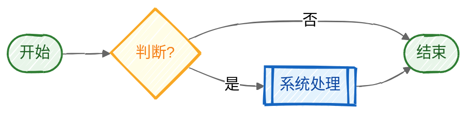

# 流程图绘制规范 v3.0

> **本规范是一个生成算法。** 从 Step 0 到 Step 6 顺序执行，每一步的输出是下一步的输入。按步骤走完 = 合规的 drawio。
>
> v3.0 是 v2.3 的完全重构：所有规则保留，但重新组织为**可机械执行的步骤序列**。不再需要跨章节查找拼凑信息。

---

## Step 0 -- 输入收集

在写任何 XML 之前，先把流程结构化为以下格式：

```yaml
title: "流程名称"
actors:              # 参与角色/系统
  - id: actor-id
    name: "显示名"
    type: primary|system|external|third-party|customer
nodes:               # 所有节点
  - id: n-xxx
    actor: actor-id  # 属于哪个角色
    label: "节点文字"
    type: start|end-ok|end-cancel|core|normal|decision|exception|sla
edges:               # 所有连线
  - from: n-xxx
    to: n-yyy
    type: main|branch|reject|async
    label: ""        # 可选
decisions:           # 判断节点的全部出口（强制 >=2）
  - node: n-xxx-q
    outputs:
      - condition: "是"
        target: n-yyy
        type: main
      - condition: "否"
        target: n-zzz
        type: branch
```

**检查点**：每个 `type: decision` 的节点在 `decisions` 列表中有 >= 2 个 outputs？通过则进入 Step 1。

---

## Step 1 -- 选型决策

### 1.1 布局模式

```
Q1: 有多个角色/系统参与？
  NO → 模式 C（状态流转图）或 模式 D（分组模块图）
  YES → Q2

Q2: 流程主方向？
  从左到右（角色分行） → 模式 A（水平泳道）
  从上到下（系统分列） → 模式 B（垂直泳道）
```

| 信号 | 选择 |
|------|------|
| 角色 >= 3 且流程横向展开 | 模式 A |
| 系统 >= 2 且流程纵向深入 | 模式 B |
| 单对象状态变化 | 模式 C |
| 功能模块组合关系 | 模式 D |

### 1.2 容器策略（仅模式 A/B）

```
Q: 泳道数 >= 3 且跨泳道边 >= 4 且流程是瀑布式（从上游泳道倾泻到下游）？
  YES → 锚定泳道策略（选一个泳道容纳所有节点，y 溢出）
  NO  → 标准多泳道策略（节点各在自己泳道，跨泳道边用 parent="1"）
```

**输出**：`layout_mode`（A/B/C/D）+ `container_strategy`（standard/anchor）

---

## Step 2 -- 画布与泳道

### 2.1 模式 A 水平泳道公式

```
lane_count     = actors 数量
col_count      = 主干节点数（不含分支）
lane_width     = max(col_count * 200 + 60, 1200)     # 保证每列 200px
lane_heights[] = 每个泳道 max(150, 该泳道行数 * 100 + 50)
lane_x         = 40                                    # 全部泳道左对齐
lane_y[]       = 50, 50+h1, 50+h1+h2, ...             # 紧贴排列
page_width     = lane_width + 80                       # 左右各留 40
page_height    = sum(lane_heights) + 50 + 80 + 70 + 40  # 上50 + 泳道 + 间隙 + 图例70 + 下40
```

### 2.2 模式 B 垂直泳道公式

```
lane_count    = actors 数量
row_count     = 最长泳道的节点数
lane_width    = 240                                    # 每列固定宽
lane_height   = max(row_count * 80 + 120, 1200)
lane_x[]      = 40, 40+240, 40+480, ...               # 紧贴排列
lane_y        = 50
page_width    = lane_count * 240 + 80
page_height   = lane_height + 50 + 80 + 70 + 40
```

### 2.3 泳道样式（查附录 B）

每个泳道的 style 根据 actor.type 从 **附录 B** 直接复制。

**输出**：`lanes[]` 数组，每个含 `{id, x, y, width, height, style}`

---

## Step 3 -- 网格放置节点（核心）

> **这是最重要的步骤。** 网格系统从构造上保证对齐，不需要事后验证。

### 3.1 定义列网格

模式 A（水平泳道）：

```
col_gap    = 200                          # 列间距（含节点宽度+走廊）
col_start  = lane_x + 60 + 80            # startSize + 首列边距
col_centers[] = [col_start, col_start + col_gap, col_start + 2*col_gap, ...]
```

**走廊保证**：列间距 200px，节点最宽 130px，走廊宽度 = 200 - 130 = 70px > 20px 安全距离。线不可能穿越节点。

### 3.2 定义行网格

模式 A（水平泳道），每个泳道内：

```
row_gap = 80                              # 行间距
row_start = 泳道内顶部间距 40px
row_centers[] = [row_start + 25, row_start + 25 + row_gap, ...]
  # +25 是半个标准节点高度(50/2)
```

### 3.3 节点坐标计算

对每个节点，分配 `(col_index, row_index)`，然后：

```
node_center_x = col_centers[col_index]                 # 全局 center x
node_center_y = lane_y[actor_index] + row_centers[row_index]  # 全局 center y

local_x = node_center_x - lane_x - node_width / 2     # 泳道内相对 x
local_y = row_centers[row_index] - node_height / 2     # 泳道内相对 y
```

**关键保证**：
- 同列节点共享 `col_centers[i]` → center_x 天然 0px 对齐
- 同行节点共享 `row_centers[j]` → center_y 天然 0px 对齐
- 节点间必有走廊 → 线不可能穿越节点

### 3.4 节点尺寸（固定，不按内容调）

| type | width | height |
|------|-------|--------|
| start, end-ok, end-cancel | 100 | 36 |
| core, normal, exception, sla | 120 | 50 |
| decision | 110 | 70 |

### 3.5 节点样式（查附录 A）

每个节点的 style 根据 node.type 从 **附录 A** 直接复制。

### 3.6 锚定泳道策略的特殊处理

当 Step 1 决策为 `container_strategy: anchor` 时：
1. 所有节点的 `parent` 指向锚定泳道 ID
2. 下游泳道节点的 `local_y` = 本泳道区域高度 + 下游泳道偏移量
3. 下游泳道保留为空壳（仅有泳道定义，无子节点）
4. 连线 `parent` 也指向锚定泳道 ID

**输出**：`nodes[]` 数组，每个含 `{id, parent, local_x, local_y, width, height, style, label}`

---

## Step 4 -- 连线路由

逐条边处理。**对菱形节点：必须在此步一次性路由全部出口，不能留到后面补。**

### 4.1 判断连线类型

对每条边 `(source, target)`：

```
same_col = (source.col_index == target.col_index)
same_row = (source.row_index == target.row_index) 且同一泳道
```

### 4.2 路由规则

| 场景 | 路由 | exit/entry | waypoints | jettySize |
|------|------|-----------|-----------|-----------|
| 同行水平相邻 | 纯水平 1 段 | exit(1,0.5) entry(0,0.5) | 无 | auto |
| 同列垂直（含跨泳道） | 纯垂直 1 段 | exit(0.5,1) entry(0.5,0) | 无 | **0** |
| 不同行不同列（目标在右下） | L 形 2 段 | exit(0.5,1) entry(0,0.5) | 无 | auto |
| 不同行不同列（目标在右上） | L 形 2 段 | exit(0.5,0) entry(0,0.5) | 无 | auto |
| 回连/驳回（目标在左方） | 绕行 3~5 段 | 按实际 | 必须加 | auto |

### 4.3 跨泳道跳级验证

当 source 和 target 之间隔了一个泳道时（如 SAP→经销商，跳过总部）：

```
corridor_left  = 跳过泳道中所有节点的最大右边界 + 20px
corridor_right = 跳过泳道中所有节点的最小左边界 - 20px

if source_center_x > corridor_left && source_center_x < corridor_right:
    # 走廊畅通，纯垂直直连
else:
    # 走廊被阻，右移目标节点 或 加 waypoints 绕行
```

### 4.4 回连线路由

驳回/重试等回连线（目标在源的左方），用泳道顶部或底部空间绕行：

```
waypoints:
  - (source_center_x, bypass_y)    # 源正上/下方拐点
  - (target_center_x, bypass_y)    # 目标正上/下方拐点

bypass_y 计算：
  上绕 = lane_y + 10（泳道内顶部间隙）
  下绕 = lane_y + lane_height - 10（泳道内底部间隙）
```

### 4.5 连线样式（查附录 C）

每条边的 style 根据 edge.type 从 **附录 C** 直接复制。

### 4.6 连线 parent 规则

| container_strategy | 同泳道内连线 | 跨泳道连线 |
|-------------------|------------|-----------|
| standard | parent=泳道ID | parent="1" |
| anchor | parent=锚定泳道ID | parent=锚定泳道ID（节点都在同容器） |

**输出**：`edges[]` 数组，每条含 `{id, parent, source, target, style, waypoints[], label}`

---

## Step 5 -- 装饰层

### 5.1 白色背景底板

```xml
<mxCell id="bg" value=""
  style="rounded=1;whiteSpace=wrap;html=1;fillColor=#FFFFFF;strokeColor=#E0E0E0;arcSize=4;"
  parent="1" vertex="1">
  <mxGeometry x="{lane_x - 20}" y="{title_y - 20}"
    width="{lane_width + 40}" height="{legend_bottom - title_y + 40}" as="geometry"/>
</mxCell>
```

### 5.2 标题栏

```xml
<mxCell id="title-bg" value=""
  style="rounded=1;whiteSpace=wrap;html=1;fillColor=#861B2F;strokeColor=#6A1525;arcSize=6;"
  parent="1" vertex="1">
  <mxGeometry x="{lane_x}" y="6" width="{lane_width}" height="38" as="geometry"/>
</mxCell>
<mxCell id="title" value="{title}"
  style="text;html=1;align=center;verticalAlign=middle;fontSize=20;fontStyle=1;fontColor=#ffffff;"
  parent="1" vertex="1">
  <mxGeometry x="{lane_x}" y="6" width="{lane_width}" height="38" as="geometry"/>
</mxCell>
```

### 5.3 图例

横排单行，与泳道等宽，高 70px，位于最后一个泳道底部 +20px：

```
legend_y = last_lane_y + last_lane_height + 20
legend_width = lane_width
legend_height = 70
```

图例内容从实际使用的节点类型中选取（只放流程中用到的类型），每个缩微节点横排间距 80px。

**输出**：装饰元素的完整 XML

---

## Step 6 -- 组装 XML + 验证

### 6.1 XML 组装顺序

```xml
<mxGraphModel dx="..." dy="..." grid="1" gridSize="10" guides="1" tooltips="1"
  connect="1" arrows="1" fold="1" page="1" pageScale="1"
  pageWidth="{page_width}" pageHeight="{page_height}" math="0" shadow="0">
  <root>
    <mxCell id="0"/>
    <mxCell id="1" parent="0"/>
    {bg}           <!-- 1. 白色背景底板 -->
    {title-bg}     <!-- 2. 标题背景 -->
    {title}        <!-- 3. 标题文字 -->
    {lanes[]}      <!-- 4. 泳道定义 -->
    {nodes[]}      <!-- 5. 所有节点（在各自泳道内） -->
    {edges[]}      <!-- 6. 所有连线 -->
    {legend}       <!-- 7. 图例 -->
  </root>
</mxGraphModel>
```

`dx` 和 `dy` 通常设 `dx=page_width, dy=page_height`（控制初始视口滚动位置）。

### 6.2 数学验证（必做，逐条检查）

生成 XML 后，执行以下公式验证。**全部通过 = 可交付**：

```
V1. 同列对齐：
    for each col_index in used_cols:
      nodes_in_col = [n for n in nodes if n.col_index == col_index]
      assert all(n.center_x == nodes_in_col[0].center_x for n in nodes_in_col)

V2. 同行对齐：
    for each (lane, row_index) pair:
      nodes_in_row = [n for n in nodes if n.lane==lane and n.row_index==row_index]
      assert all(n.center_y == nodes_in_row[0].center_y for n in nodes_in_row)

V3. 菱形双输出：
    for each node where type == "decision":
      outgoing = [e for e in edges if e.source == node.id]
      assert len(outgoing) >= 2

V4. 走廊清晰（线不穿节点）：
    for each edge with waypoints:
      for each waypoint (wx, wy):
        for each node N not in (edge.source, edge.target):
          assert not (N.x-20 < wx < N.x+N.w+20 and N.y-20 < wy < N.y+N.h+20)

V5. 跨泳道边 parent 正确：
    for each edge where source.lane != target.lane:
      if container_strategy == "standard":
        assert edge.parent == "1"
      elif container_strategy == "anchor":
        assert edge.parent == anchor_lane_id

V6. 节点不越界：
    for each node:
      assert node.local_x >= 20  # 不贴泳道左边
      assert node.local_x + node.width <= lane_width - 20  # 不贴右边
```

---

## 附录 A -- 节点样式查找表

> 直接复制整个 style 字符串，不需要拼装。

| type | style（完整，直接用） | 尺寸 |
|------|---------------------|------|
| **start** | `rounded=1;whiteSpace=wrap;html=1;fillColor=#861B2F;fontColor=#ffffff;strokeColor=#6A1525;arcSize=50;fontSize=12` | 100x36 |
| **end-ok** | `rounded=1;whiteSpace=wrap;html=1;fillColor=#52C41A;fontColor=#ffffff;strokeColor=#389E0D;arcSize=50;fontSize=12` | 100x36 |
| **end-cancel** | `rounded=1;whiteSpace=wrap;html=1;fillColor=#BFBFBF;fontColor=#ffffff;strokeColor=#8C8C8C;arcSize=50;fontSize=12` | 100x36 |
| **core** | `rounded=1;whiteSpace=wrap;html=1;fillColor=#861B2F;fontColor=#ffffff;strokeColor=#6A1525;arcSize=6;fontSize=12` | 120x50 |
| **normal** | `rounded=1;whiteSpace=wrap;html=1;fillColor=#ffffff;strokeColor=#861B2F;fontColor=#1A1A1A;arcSize=6;fontSize=12` | 120x50 |
| **decision** | `rhombus;whiteSpace=wrap;html=1;fillColor=#FAAD14;fontColor=#1A1A1A;strokeColor=#D48806;fontSize=11` | 110x70 |
| **exception** | `rounded=1;whiteSpace=wrap;html=1;fillColor=#FFF1F0;strokeColor=#FF4D4F;fontColor=#CF1322;arcSize=6;fontSize=12;dashed=1` | 120x50 |
| **sla** | `rounded=1;whiteSpace=wrap;html=1;fillColor=#FFF7E6;strokeColor=#FAAD14;fontColor=#AD6800;arcSize=6;fontSize=11;dashed=1` | 130x50 |
| **data**（输入/输出） | `shape=parallelogram;perimeter=parallelogramPerimeter;whiteSpace=wrap;html=1;fixedSize=1;fillColor=#e1d5e7;strokeColor=#9673a6;fontSize=11` | 140x30 |

---

## 附录 B -- 泳道样式查找表

| actor.type | 典型角色 | style（含 `swimlane;horizontal=0;startSize=60;rounded=0;fontSize=14;fontStyle=1`） |
|-----------|---------|-----|
| **primary** | 经销商/门店/SA/主管 | `fillColor=#FFF7F0;strokeColor=#861B2F;fontColor=#861B2F` |
| **system** | DMS/核心系统 | `fillColor=#E3F2FD;strokeColor=#1565C0;fontColor=#1565C0` |
| **external** | SAP/WMS/ERP | `fillColor=#F5F5F5;strokeColor=#666666;fontColor=#333333` |
| **third-party** | 支付/物流/滴滴 | `fillColor=#F3E5F5;strokeColor=#7B1FA2;fontColor=#7B1FA2` |
| **customer** | 客户/用户/APP | `fillColor=#FFF7F0;strokeColor=#861B2F;fontColor=#861B2F` |
| **neutral** | 协作方/白底泳道 | `fillColor=#ffffff;strokeColor=#666666;fontColor=#1A1A1A` |

完整泳道 style 组装：`swimlane;horizontal=0;startSize=60;{上表色值};rounded=0;fontSize=14;fontStyle=1`

---

## 附录 C -- 连线样式查找表

> 所有连线的基础属性：`edgeStyle=orthogonalEdgeStyle;rounded=1;orthogonalLoop=1;html=1;`

| edge.type | 追加属性 | 完整 style（基础 + 追加） |
|-----------|---------|--------------------------|
| **main** | `strokeColor=#333333;strokeWidth=2;` | `edgeStyle=orthogonalEdgeStyle;rounded=1;orthogonalLoop=1;html=1;strokeColor=#333333;strokeWidth=2;` |
| **branch** | `strokeColor=#666666;` | `edgeStyle=orthogonalEdgeStyle;rounded=1;orthogonalLoop=1;html=1;strokeColor=#666666;` |
| **reject** | `strokeColor=#FF4D4F;dashed=1;fontColor=#FF4D4F;` | `edgeStyle=orthogonalEdgeStyle;rounded=1;orthogonalLoop=1;html=1;strokeColor=#FF4D4F;dashed=1;fontColor=#FF4D4F;` |
| **async** | `strokeColor=#1890FF;dashed=1;fontColor=#1890FF;` | `edgeStyle=orthogonalEdgeStyle;rounded=1;orthogonalLoop=1;html=1;strokeColor=#1890FF;dashed=1;fontColor=#1890FF;` |
| **approve** | `strokeColor=#52C41A;strokeWidth=2;fontColor=#52C41A;` | `edgeStyle=orthogonalEdgeStyle;rounded=1;orthogonalLoop=1;html=1;strokeColor=#52C41A;strokeWidth=2;fontColor=#52C41A;` |
| **sla** | `strokeColor=#FAAD14;` | `edgeStyle=orthogonalEdgeStyle;rounded=1;orthogonalLoop=1;html=1;strokeColor=#FAAD14;` |

**同列垂直直连**追加：`jettySize=0;exitX=0.5;exitY=1;exitDx=0;exitDy=0;entryX=0.5;entryY=0;entryDx=0;entryDy=0;`

**L 形连线**追加（按方向）：

| 目标在源的... | exit | entry |
|--------------|------|-------|
| 右下 | `exitX=0.5;exitY=1;exitDx=0;exitDy=0;` | `entryX=0;entryY=0.5;entryDx=0;entryDy=0;` |
| 右上 | `exitX=0.5;exitY=0;exitDx=0;exitDy=0;` | `entryX=0;entryY=0.5;entryDx=0;entryDy=0;` |
| 正下 | `exitX=0.5;exitY=1;exitDx=0;exitDy=0;` | `entryX=0.5;entryY=0;entryDx=0;entryDy=0;` |
| 正右 | `exitX=1;exitY=0.5;exitDx=0;exitDy=0;` | `entryX=0;entryY=0.5;entryDx=0;entryDy=0;` |

---

## 附录 D -- 错误诊断表

> 出问题了？对照下表找到你在哪一步犯了错。

| 渲染后看到的问题 | 根因 | 你在哪步做错了 | 修复方法 |
|-----------------|------|--------------|---------|
| 连线歪了（不是纯直线） | 同列 center_x 不对齐 | Step 3: 没从 col_centers 取值 | 重算 local_x = col_center - lane_x - width/2 |
| 线穿过了一个节点 | 节点间走廊不够 | Step 3: col_gap 太小 或节点不在网格上 | 加大 col_gap 到 200+ 或移节点到正确网格位置 |
| 菱形只有一个出口 | 漏了分支 | Step 4: 没对 decision 一次性路由全部出口 | 回到 Step 0 检查 decisions 列表是否完整 |
| 连线绕了奇怪的路 | 跨容器路由偏移 | Step 1: 该用锚定策略却用了标准策略 | 回到 Step 1 重新评估容器策略 |
| 主流程看不出来 | 主干线没加粗 | Step 4: 用错了 edge style | main 类型必须用 strokeWidth=2 + #333333 |
| 同行节点高低不齐 | 同行 center_y 不一致 | Step 3: 没从 row_centers 取值 | 重算 local_y = row_center - height/2 |
| C 形短翼（直连线多了水平段） | jettySize=auto 在垂直直连上 | Step 4: 同列直连没加 jettySize=0 | 加上 jettySize=0 |
| 标签文字压在节点上 | 标签默认位置与节点重叠 | Step 4: 没加 offset | 加 `<mxPoint as="offset" x="0" y="-15"/>` |
| 渲染出红色矩形/底色异常 | 缺白色背景底板 | Step 5: 漏了 bg | 补 bg cell，确保 z-order 最低 |

---

## 附录 E -- 完整模板

### 模板 A：水平泳道（3 角色协作流程）

```xml
<mxGraphModel dx="1400" dy="800" grid="1" gridSize="10" guides="1" tooltips="1" connect="1" arrows="1" fold="1" page="1" pageScale="1" pageWidth="1400" pageHeight="800" math="0" shadow="0">
  <root>
    <mxCell id="0"/>
    <mxCell id="1" parent="0"/>
    <!-- bg: x=20, y=-14, w=lane_width+40=1360, h=全高+40 -->
    <mxCell id="bg" value="" style="rounded=1;whiteSpace=wrap;html=1;fillColor=#FFFFFF;strokeColor=#E0E0E0;arcSize=4;" parent="1" vertex="1">
      <mxGeometry x="20" y="-14" width="1360" height="794" as="geometry"/>
    </mxCell>
    <!-- 标题栏 -->
    <mxCell id="title-bg" value="" style="rounded=1;whiteSpace=wrap;html=1;fillColor=#861B2F;strokeColor=#6A1525;arcSize=6;" parent="1" vertex="1">
      <mxGeometry x="40" y="6" width="1300" height="38" as="geometry"/>
    </mxCell>
    <mxCell id="title" value="流程名称" style="text;html=1;align=center;verticalAlign=middle;fontSize=20;fontStyle=1;fontColor=#ffffff;" parent="1" vertex="1">
      <mxGeometry x="40" y="6" width="1300" height="38" as="geometry"/>
    </mxCell>
    <!-- 泳道 1: primary -->
    <mxCell id="lane-1" value="角色A" style="swimlane;horizontal=0;startSize=60;fillColor=#FFF7F0;strokeColor=#861B2F;fontColor=#861B2F;rounded=0;fontSize=14;fontStyle=1" parent="1" vertex="1">
      <mxGeometry x="40" y="50" width="1300" height="180" as="geometry"/>
    </mxCell>
    <!-- 泳道 2: system -->
    <mxCell id="lane-2" value="系统B" style="swimlane;horizontal=0;startSize=60;fillColor=#E3F2FD;strokeColor=#1565C0;fontColor=#1565C0;rounded=0;fontSize=14;fontStyle=1" parent="1" vertex="1">
      <mxGeometry x="40" y="230" width="1300" height="180" as="geometry"/>
    </mxCell>
    <!-- 泳道 3: external -->
    <mxCell id="lane-3" value="外部C" style="swimlane;horizontal=0;startSize=60;fillColor=#F5F5F5;strokeColor=#666666;fontColor=#333333;rounded=0;fontSize=14;fontStyle=1" parent="1" vertex="1">
      <mxGeometry x="40" y="410" width="1300" height="180" as="geometry"/>
    </mxCell>
    <!-- 节点示例: col_centers=[180, 380, 580, 780, 980] -->
    <mxCell id="n-start" value="开始" style="rounded=1;whiteSpace=wrap;html=1;fillColor=#861B2F;fontColor=#ffffff;strokeColor=#6A1525;arcSize=50;fontSize=12" parent="lane-1" vertex="1">
      <mxGeometry x="130" y="72" width="100" height="36" as="geometry"/>
    </mxCell>
    <!-- 图例 -->
    <mxCell id="legend-box" value="图例" style="rounded=0;whiteSpace=wrap;html=1;fillColor=#FAFAFA;strokeColor=#D9D9D9;fontColor=#666666;fontSize=11;fontStyle=1;verticalAlign=top;" parent="1" vertex="1">
      <mxGeometry x="40" y="610" width="1300" height="70" as="geometry"/>
    </mxCell>
  </root>
</mxGraphModel>
```

### 模板 C：状态流转图（无泳道，单列主干）

```xml
<mxGraphModel dx="600" dy="900" grid="1" gridSize="10" guides="1" tooltips="1" connect="1" arrows="1" fold="1" page="1" pageScale="1" pageWidth="600" pageHeight="900" math="0" shadow="0">
  <root>
    <mxCell id="0"/>
    <mxCell id="1" parent="0"/>
    <mxCell id="bg" value="" style="rounded=1;whiteSpace=wrap;html=1;fillColor=#FFFFFF;strokeColor=#E0E0E0;arcSize=4;" parent="1" vertex="1">
      <mxGeometry x="20" y="-14" width="560" height="714" as="geometry"/>
    </mxCell>
    <mxCell id="title-bg" value="" style="rounded=1;whiteSpace=wrap;html=1;fillColor=#861B2F;strokeColor=#6A1525;arcSize=6;" parent="1" vertex="1">
      <mxGeometry x="40" y="6" width="520" height="38" as="geometry"/>
    </mxCell>
    <mxCell id="title" value="状态流转" style="text;html=1;align=center;verticalAlign=middle;fontSize=20;fontStyle=1;fontColor=#ffffff;" parent="1" vertex="1">
      <mxGeometry x="40" y="6" width="520" height="38" as="geometry"/>
    </mxCell>
    <!-- 主干: 统一 x=240(center=300), y 间距 80px -->
    <mxCell id="n-s1" value="状态1" style="rounded=1;whiteSpace=wrap;html=1;fillColor=#861B2F;fontColor=#ffffff;strokeColor=#6A1525;arcSize=50;fontSize=12" parent="1" vertex="1">
      <mxGeometry x="250" y="60" width="100" height="36" as="geometry"/>
    </mxCell>
    <!-- 分支: x=440(右偏200px) -->
    <!-- 主干连线: jettySize=0, strokeWidth=2 -->
    <!-- 图例: y=630, w=520, h=60 -->
  </root>
</mxGraphModel>
```

---

## 附录 F -- ID 命名规范

```
泳道：   lane-{角色缩写}          例: lane-dealer, lane-dms, lane-sap
节点：   n-{泳道缩写}-{动作缩写}   例: n-dms-receive, n-dealer-submit
判断：   n-{泳道缩写}-{主题}-q     例: n-dms-stock-q, n-mall-direct-q
连线：   e{序号}  或  e-{语义}     例: e01, e02, e-reject, e-approve
图例：   lg-{序号}                 例: lg-1, lg-2
背景：   bg
标题：   title-bg, title
```

---

## 附录 G -- Mermaid（极简辅助）

> 仅限 <=6 节点的极简示意。超过 6 个节点一律用 drawio。



---

## 附录 H -- 与其他规范关系

| 本规范 | 关联规范 | 关系 |
|--------|----------|------|
| Step 0 输入 | [[{项目}PRD硬约束-v3.3]] §7 | PRD 交付物强制 drawio |
| 附录 A 品牌色 | [[品牌规范]] | 品牌红 #861B2F 来源 |
| 附录 B 泳道色 | [[原型输出规范-v3.2]] | 功能色共享 token |
| 附录 F 文件存放 | 模块 README | `![[流程01-xxx.drawio]]` 引用 |

---

## 变更记录

| 日期 | 版本 | 变更 | 作者 |
|------|------|------|------|
| 2026-05-17 | v3.0 | **从声明式到生成式完全重构**：7 步生成算法 + 网格放置保证对齐 + 查找表直接复制 + 数学验证替代人眼检查。v2.3 全部规则保留，按执行顺序重组织 | Claudian |
| 2026-05-17 | v2.0~v2.3 | 历史版本（8 次迭代），声明式规则清单 + Checklist | Claudian / Claudian |
| 2026-04-28 | v1.0 | 初版（Mermaid + Excalidraw） | AI |

---

*最后更新：2026-05-17 v3.0 Claudian*
