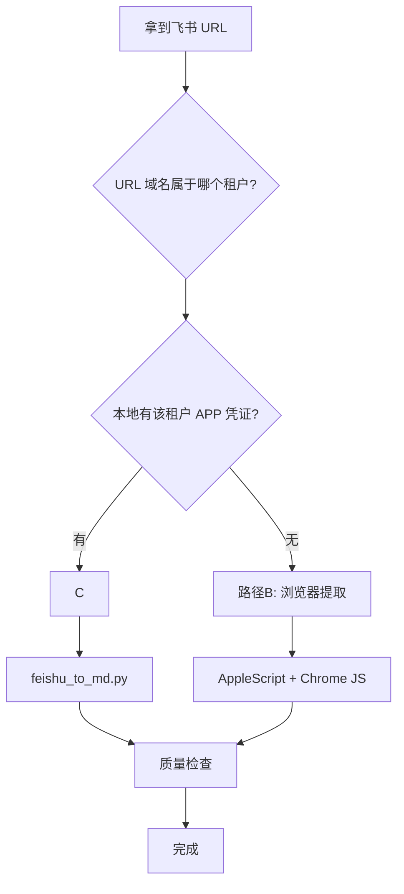

# 飞书文档采集规范 v1.0

> 定义从飞书文档到 Obsidian vault 的标准化采集流程。任何 agent 拿到本规范即可执行。

---

## 1 采集路径选择



### 路径 A — API 全自动（推荐）

**适用**：有飞书自建应用凭证的同租户文档
**工具**：`.scripts/feishu_to_md.py`
**能力**：标题 / 表格 / 列表 / 代码块 / 图片下载 / frontmatter 生成

starter 不分发任何飞书租户信息或密钥。使用者需在本地配置：

```bash
export FEISHU_APP_ID="你的飞书应用 App ID"
export FEISHU_APP_SECRET="你的飞书应用 App Secret"
```

如需多租户，可按飞书 URL 子域配置：

```bash
export FEISHU_YOURTENANT_APP_ID="你的飞书应用 App ID"
export FEISHU_YOURTENANT_APP_SECRET="你的飞书应用 App Secret"
```

```bash
# wiki 知识库文档
python3 .scripts/feishu_to_md.py "https://xxx.feishu.cn/wiki/TOKEN" "输出路径.md"

# 独立 docx 文档
python3 .scripts/feishu_to_md.py "https://xxx.feishu.cn/docx/TOKEN" "输出路径.md"

# 跳过图片下载（快速预览）
python3 .scripts/feishu_to_md.py "URL" "输出.md" --no-images
```

### 路径 B — 浏览器提取（降级）

**适用**：跨租户 / 无 API 权限 / 非 docx 类型文档
**前提**：用户在 Chrome 中已打开目标文档

```bash
# Step 1: 确认 Chrome 当前标签页
osascript -e 'tell application "Google Chrome" to get URL of active tab of front window'

# Step 2: 提取结构化内容
osascript -e 'tell application "Google Chrome" to tell active tab of front window to execute javascript "
    var el = document.querySelector(\"[data-content-editable-root]\");
    el ? el.innerText : \"NOT_FOUND\";
"'

# Step 3: Python 后处理（bullet符号转Markdown列表等）
```

**注意**：浏览器提取**无法获取图片**，仅提取文本+结构。

---

## 2 存储约定

| 文档类型 | 存储路径 | 图片目录 | 命名规则 |
|---------|---------|---------|---------|
| 大型 PRD / 产品文档 | `20-资料/业务文件/{标题}.md` | `20-资料/业务文件/{标题}-images/` | 原标题，去特殊字符 |
| 会议纪要 | `20-资料/会议纪要/YYYYMMDD-{主题}.md` | 通常无图片 | 遵循 [[会议纪要处理规范]] |
| 技术文档 | `20-资料/业务文件/{标题}.md` | 同大型 PRD | 原标题 |

---

## 3 Frontmatter 字段

必填字段：

```yaml
---
title: "文档标题"        # 飞书原标题
source: "完整飞书URL"    # 可追溯
fetched: "2026-05-16"    # 采集日期
type: "飞书文档"         # 固定值
---
```

可选字段：

```yaml
tags: [PRD, 服务模块]    # 按内容分类
cssclasses: []           # 如需特殊样式
date: 2026-05-14         # 文档原始日期（会议纪要必填）
```

---

## 4 图片处理规则

| 规则 | 说明 |
|------|------|
| 存储位置 | `{文档名}-images/img_001.png` 等，与 `.md` 同级目录 |
| 嵌入语法 | `![[路径/img_001.png]]`（Obsidian wikilink 格式） |
| 不得残留 token | 最终文档中不允许出现 ``，全部替换为本地路径 |
| 下载失败 | 标注 `<!-- 图片下载失败: {token} -->` 保留线索 |

---

## 5 格式规范

### 5.1 表格

- 表格前**必须有空行**，否则 Obsidian 不渲染
- 表头分隔符用 `|---|` 格式
- 单元格内 `|` 需转义为 `\|`

> 表格格式的完整规则见 [[Markdown文档输出规范]] §3。

### 5.2 标题编号

大型文档（>50 个标题）建议添加层级编号：

```
# 1 版本信息          ← H1 从 1 开始
## 4.1 需求模块范围    ← H2 = 父级.序号
### 4.4.1 功能清单-PC  ← H3 = 父级.序号
```

- 文档标题（第一个 H1）**不编号**
- 非内容性标题（通知/注释）转为 callout

> 标题编号的完整规则见 [[Markdown文档输出规范]] §2。

### 5.3 不可转换内容

| 飞书元素 | 处理方式 |
|---------|---------|
| 画板/白板 (block_type=43) | `*(飞书画板/白板，无法转为文本)*` |
| 嵌入的 Sheet | 保留链接 `[表格标题](飞书URL)` |
| 评论/批注 | 丢弃（无 API 支持） |

---

## 6 质量检查清单

采集完成后逐项确认：

- [ ] **大纲可见**：Obsidian 右侧大纲面板显示完整标题层级
- [ ] **表格渲染**：抽查 3 个表格，均正常显示为表格（非纯文本 `|`）
- [ ] **图片显示**：抽查 5 张图片，均能在 Obsidian 中显示（非 token 字符串）
- [ ] **frontmatter 正确**：title / source / fetched / type 四个字段齐全
- [ ] **无乱码**：浏览全文无零宽字符残留（`​` `‌` `‍` 等）
- [ ] **编号正确**（如有）：与飞书原文大纲编号一致

---

## 7 已知限制

| 限制 | 说明 | 应对 |
|------|------|------|
| 租户隔离 | 自建应用凭证只能访问本租户文档 | 降级到路径 B |
| 画板不可转 | 飞书白板/思维导图无文本 API | 手动截图后嵌入 |
| 评论丢失 | 飞书文档评论无公开 API | 需手动摘录 |
| Sheet 内容 | 嵌入的电子表格无法通过 docx API 获取 | 需单独用 Sheets API |

---

## 8 脚本依赖

| 组件 | 路径 | 说明 |
|------|------|------|
| 采集脚本 | `.scripts/feishu_to_md.py` | 零外部依赖，纯 Python 3 标准库 |
| APP 凭证 | 本地环境变量或 CLI 参数 | `FEISHU_APP_ID` / `FEISHU_APP_SECRET`，或 `--app-id` / `--app-secret` |
| AppleScript | 命令行直接调用 | macOS 原生，无需安装 |

---

## 变更日志

| 日期 | 版本 | 变更 |
|------|------|------|
| 2026-05-16 | v1.0 | 初版：两条采集路径、存储约定、格式规范、质量检查清单 |
| 2026-05-16 | v1.0.1 | §5.1 §5.2 追加交叉引用 → [[Markdown文档输出规范]] §2 §3 |
