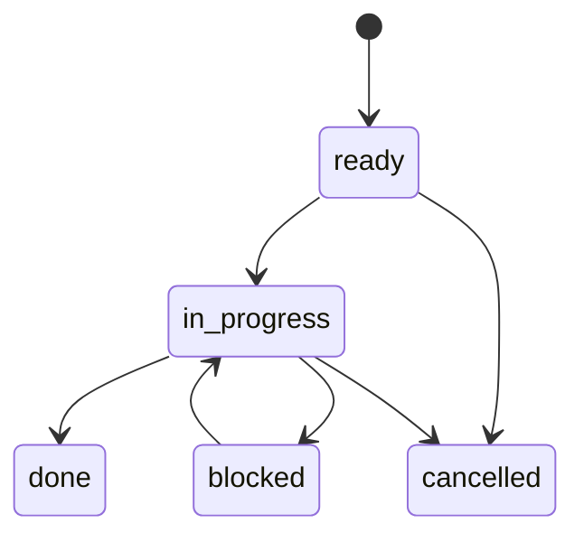
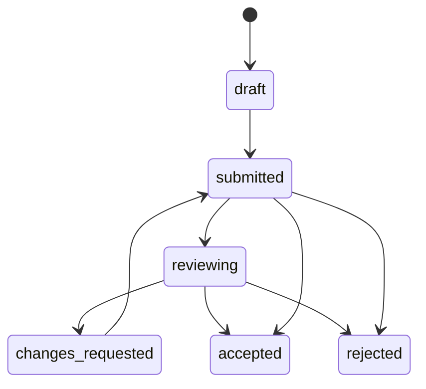

# V9.4 任务状态机硬化设计

> 目标：把 `submitted ≠ accepted` 从纪律变成机器可读约束，同时不破坏现有任务卡的 `status=done` 执行收工口径。

## 1. 当前问题

V9 现在有两条状态混在一起：

| 层次 | 现状字段 | 问题 |
|---|---|---|
| 执行状态 | `status: ready/in_progress/done/blocked/cancelled` | `done` 表示 Agent 收工，不等于用户验收 |
| 验收状态 | 散落在正文、handoff、产物 state | 没有统一字段，无法强制 `accepted_by != owner` |

结果是：

- Agent 可以如实写“done”，但读者容易把它理解成“accepted”。
- 方案文档可以写 `review_verdict: accepted_with_changes`，但任务卡没有统一验收人字段。
- eval-runner 想测 `reviewer == author`，缺少机器可读 fixture 目标。

## 2. 设计原则

| 原则 | 说明 |
|---|---|
| 双状态，不替换 | 保留 `status` 表示执行收工；新增 `review_status` 表示验收态 |
| 新卡渐进 | 只要求新建/新改 V9 治理任务使用新字段，不回填所有历史卡 |
| 只硬拦 accepted | 缺字段先 advisory；只有声称 accepted 时才硬拦 |
| 人类验收为准 | Agent 可以 submitted，不能自己 accepted |
| 绿灯无感 | 普通内部收工只需 `done + submitted`；不要求每次都找人当场验收 |

## 3. 建议字段

新增顶层 frontmatter 字段，优先不用嵌套，方便现有正则型脚本读取：

| 字段 | 必填阶段 | 说明 |
|---|---|---|
| `author` | 新卡建议 | 产物作者；默认可等于 `owner` |
| `review_status` | 新 V9 治理卡建议 | `draft/submitted/reviewing/changes_requested/accepted/rejected/not_required` |
| `reviewer` | `review_status != not_required` | 指定验收方；未填默认人工Reviewer |
| `submitted_at` | submitted 及以后 | Agent 提交验收的时间 |
| `accepted_by` | accepted 必填 | 实际确认 accepted 的人或 Agent |
| `accepted_at` | accepted 必填 | accepted 时间 |
| `acceptance_result` | accepted/rejected/changes_requested 必填 | `accepted/rejected/changes_requested` |
| `acceptance_note` | 可选 | 验收意见或变更条件 |

最小示例：

```yaml
owner: "红霉素(Codex)"
author: "红霉素(Codex)"
status: done
review_status: submitted
reviewer: "人工Reviewer"
submitted_at: 2026-06-26T19:30:00+08:00
accepted_by: null
accepted_at: null
acceptance_result: null
```

accepted 示例：

```yaml
status: done
review_status: accepted
reviewer: "人工Reviewer"
accepted_by: "人工Reviewer"
accepted_at: 2026-06-26T20:00:00+08:00
acceptance_result: accepted
```

## 4. 状态机

### 4.1 执行状态



执行状态仍使用现有 `status` 字段。

### 4.2 验收状态



验收状态使用新增 `review_status` 字段。

## 5. 硬规则

| 规则 | 严重度 | 说明 |
|---|---|---|
| `review_status=accepted` 但 `accepted_by` 为空 | p1 | 不能无验收人 accepted |
| `review_status=accepted` 且 `accepted_by == owner/author` | p1 | Agent 不能自验收 |
| `accepted_at` 为空 | p1 | accepted 必须有时间 |
| `acceptance_result != accepted` 但 `review_status=accepted` | p1 | 状态与结果不一致 |
| `status=done` 但 `review_status` 为空 | advisory | 迁移期只提示，不硬拦 |
| `review_status=submitted` 却声称“已验收/accepted” | p1 | 防止文本口径越界 |

## 6. 迁移节奏

| 阶段 | 动作 | 门禁强度 |
|---|---|---|
| A. 文档生效 | 本设计进入 submitted，供评审 | 无门禁 |
| B. 模板更新 | 新任务卡模板增加 review 字段 | 无门禁 |
| C. 只读扫描 | 新增 `v9-task-state-check.py --json`，接入反射器第六源 | advisory/p1 只报告 |
| D. eval 接入 | `v9-harness-eval-runner.py` 增加 `reviewer==author` negative fixture | 手动回归 |
| E. pre-accept | 增加 `pre-accept` 命令，只有它能把 submitted 推到 accepted | 红灯硬拦 |

建议先做 B/C/D，观察 1 周，再考虑 E。

## 7. 未来 validator 设计

脚本候选：`02-项目管理/脚本/v9-task-state-check.py`

输入：

```bash
python3 02-项目管理/脚本/v9-task-state-check.py --json
python3 02-项目管理/脚本/v9-task-state-check.py --task 02-项目管理/任务卡/2026-06/T-xxx.md --json
```

输出沿用统一 findings schema：

```json
{
  "severity": "p1",
  "rule_id": "ACCEPTED_BY_SELF",
  "object": "02-项目管理/任务卡/2026-06/T-xxx.md",
  "message": "review_status=accepted 但 accepted_by 与 owner/author 相同",
  "source": "task-state"
}
```

## 8. eval-runner 追加样本

状态机 validator 出现后，`v9-harness-eval-runner.py` 追加：

| case | 类型 | 断言 |
|---|---|---|
| `task_state_positive_submitted` | positive | `done + review_status=submitted + accepted_by=null` 不产生 p1 |
| `task_state_negative_self_accept` | negative | `accepted_by == owner` 触发 `ACCEPTED_BY_SELF` |
| `task_state_negative_missing_acceptor` | negative | `review_status=accepted` 但缺 `accepted_by` 触发 `ACCEPTED_BY_MISSING` |
| `task_state_negative_text_overclaim` | negative | `review_status=submitted` 但正文声称“已验收”触发 `ACCEPTANCE_OVERCLAIM` |

## 9. 开放问题

| 问题 | 建议默认 |
|---|---|
| `reviewer` 未填时是否默认人工Reviewer | yes |
| 历史卡是否批量回填 | no，只对新 V9 治理卡和未来模板生效 |
| `done` 是否必须配 `review_status=submitted` | 迁移期 advisory，稳定后再升 p1 |
| Agent 能否记录用户口头 accepted | 可以记录，但 `accepted_by` 必须写用户名/明确验收方，不得写自己 |

## 10. MVP 实施记录

2026-06-26 已落只读 validator MVP：

| 项 | 状态 |
|---|---|
| `02-项目管理/脚本/v9-task-state-check.py` | 已实现 |
| 真实仓库扫描 | 95 张任务卡，0 finding |
| eval-runner 正样本 | `task_state_positive_submitted` |
| eval-runner 反样本 | `task_state_negative_self_accept` / `task_state_negative_missing_acceptor` |
| 反射器接入 | 已作为第六源接入，正常状态显示 `task-state=ok(0)` |
| 自动门禁接入 | 已由 V9.4.1 接入 `v9_accept` / `gate-enforce pre-accept` / pre-write hook 候选解析 |

当前策略：只对显式声称 `review_status=accepted` 的卡做 p1 硬检查；历史 `done` 卡缺 `review_status` 默认不报，避免迁移期噪声。

## 11. V9.4.2 补充：Handoff 状态机

2026-06-27 已补 `v9-handoff-check.py`：

| 项 | 状态 |
|---|---|
| 显式 `handoff_required: true` | `status=done` 后必须有可接手 Handoff |
| 新 M5 done 任务 | 自 2026-06-27 起进入 p1 检查 |
| 历史 M5 / handoff_to 卡 | 默认不批量打红；`--strict-historical` 仅作审计 |
| eval-runner 样本 | `handoff_positive_actionable` / `handoff_negative_missing` / `handoff_negative_incomplete` |
| 反射器接入 | 已作为第八源接入，正常状态显示 `handoff=ok(0)` |

Handoff 最小字段：`status`、产物路径/产物清单、验证结果/自查结果、`next action`。
